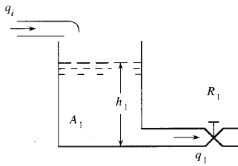
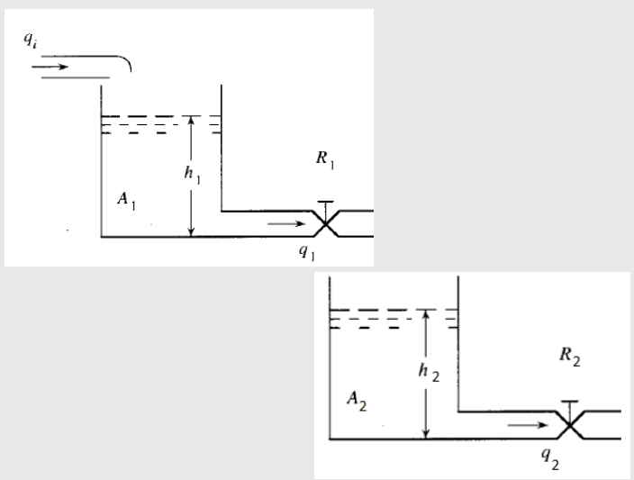
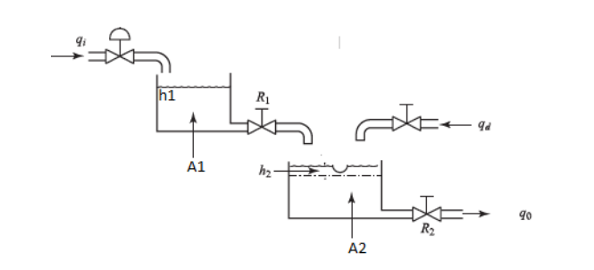
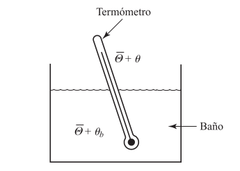

# Sistemas hidraulicos y termicos

## 1 Sistemas hidraulicos 
### 1.1 Introduccion

Los sistemas hidraulicos operan una tecnologia que utiliza los liquidos para generar movimiento o fuerza. Se rige con el principio de la ley de Pascal, la cual dice que la presion que se aplica sobre un fluido confinado se transmite uniformemente en todas las direcciones. Gracias a eso lo sistemas pueden incrementar la fuerza y manejar un control mas preciso de las maquinas.

>🔑 Ley de Pascal: Establece que la presión aplicada a un fluido incompresible se transmite de manera uniforme a todos los puntos del fluido. 
>🔑 Presion: La presión ​​ es una magnitud física que mide la proyección de la fuerza en dirección perpendicular por unidad de superficie.
>🔑 Fluido: Toda materia compuesta por moléculas que se atraen entre sí a través de una fuerza de atracción muy débil, lo que impide que puedan mantener una forma determinada y estable
### 1.2 Sistema

.

Figura 1, Tanque de agua

Este sistema funciona mediante el principio de Pascal, en el cual es fundamental que mantengan un nivel de flujo constante, en donde segun la figura 1 podemos decir que:
  - $q_{i}, q_{o}$; son los flujos de entrada y salida del liquido 
  - R, Es la resistencia al flujo
  - A, Area transversal del tanque
  - h, Nivel de liquido en el tanque  

### 1.3 Modelamiento tanques

La ecuacion que indica el flujo de salida del tanque (figura 1) es:

 - $q_{1} = \frac{h_{1}}{R_{1}}$

Para el intercambio de masa usasmos lo siguiente:

 - $A_{1}\frac{dh_{1}}{dt} = q_{i} - q_{1}$

Mostramos como queda el modelo del tanque teniendo $q_{i}$ como entrada y $h_{1}$ como altura. Primero determinamos las ecuaciones vistas anteriormente, y despues unimos las dos ecuaciones reemplazando $q_{1}$ en ambas para que nos quede en terminos de $q_{i}$ 

- $q_{1} = \frac{d_{1}}{R1}$
- $A_{1}\frac{dh_{1}}{dt} = q_{i} - q_{1}$
- $A_{1}\frac{dh_{1}}{dt} = q_{i} - \frac{h_{1}}{R_{1}}$

En este caso se modela conociendola entrada del sistema $(q_{i})$ la salida $q_{1}$. En este caso lo que hacemos es que en base a las ecuaciones que conocemos despejamos la altura, y al igual que en el otro modelamiento unimos las ecuaciones para tener un modelo en base a la entrada por la salida del sistema.

- $q_{1} = \frac{h_{1}}{R1}$
- $A_{1}\frac{dh_{1}}{dt} = q_{i} - q_{1}$
- $h_{1} = q_{1}*R1$
- $R1A_{1}\frac{dh_{1}}{dt} = q_{i} - q_{1}$ 
 
#### 1.3.1 💡 Ejemplo con dos tanques

.

Figura 2, dos tanques

En caso de trabajar con dos tanques, para modelarlo lo primero que hacemos es definir en base a que variables vamos a trabajar, en este caso lo hicimos con relacion a la entrada del primer tanque $q_{i}$ y las alturas de los tanques, esto debido a que podemos relacionar los dos sistemas con $q_{1}$, la cual es la salida del primer tanque y la entrada del segundo. Usando las formalas despejamos $q_{i}$.

$$q_{i} = A_{1}\frac{dh_{1}}{dt} + q_{1}$$

$$q_{i} = A_{1}\frac{dh_{1}}{dt} + \frac{h_{1}}{R_{1}}$$

$$\frac{h_{1}}{R_{1}} = q_{i} - A_{1}\frac{dh_{1}}{dt}$$

Como sabemos que $q_{1} = \frac{h_{1}}{R_{1}}$ entonces reemplazamos esos datos en la segunda ecuacion y despejamos.

$$\frac{h_{1}}{R_{1}} - q_{2} = A_{2}\frac{dh_{2}}{dt}$$

$$\frac{h_{1}}{R_{1}} = A_{2}\frac{dh_{2}}{dt} + q_{2}$$

Por ultimo ya que despejamos las ecuaciones lo que hacemos es unir la ecuacion de cada tanque para que quede el modelo de ambos.

$$q_{i} - A_{}\frac{dh_{1}}{dt} = A_{2}\frac{dh_{2}}{dt} + q_{2}$$

#### 1.3.2 💡 Ejemplo tanques interconectados

.

Figura 3, Tanques interconectados

En el caso de los tanques interconectados lo primero que se hace es plantear las ecuacion inciales de cada uno. Son casi iguales a las que se muestran al inicio del tema, solo que en el caso del primer tanque el caudal se ve afectado por la diferencia de altura que hay entre ambos tanques.

$$q_{1} = \frac{h_{1} - h_{2}}{R_{1}}$$

$$A_{1}\frac{dh_{1}}{dt} = (q_{i} - q_{1})$$

$$q_{2} = \frac{h_{2}}{R_{2}}$$

$$A_{2}\frac{dh_{2}}{dt} = (q_{1} - q_{2})$$

Al igual que en el ejemplo anterior la variable que relaciona ambos tanques es $q_{1}$ por lo tanto lo primero que haremos es despejarla para poder relacionar los dos tanques despues

$$R_{2}A_{2}\frac{dq_{2}}{dt} = (q_{1} - q_{2})$$

$$R_{2}A_{2}\frac{dq_{2}}{dt} + q_{2} = q_{1}$$

Luego reemplazamos el valor de q_{1}, en la ecuacion. 

$$A_{1}\frac{dh_{1}}{dt} = (q_{i} - R_{2}A_{2}\frac{dq_{2}}{dt} + q_{2})$$

Lo siguiente que hacemos es despejar el h_{1} de la ecuacion para que todo quede en terminos del segundo tanque.

$$R_{1}q_{1} + h_{2} = h_{1}$$

$$R_{1}(R_{2}A_{2}\frac{dq_{2}}{dt} + q_{2}) + R_{2}q_{2} = h_{1}$$

Una vez despejado el h_{1}, lo reemplazamos en nuestra ecuacion combinada. Por ultimo una vez lo tenemos todo lo que hacemos es despejar lo que tenemos y organizamos la ecuacion para que el modelo quede listo. 

$$A_{1}d\frac{(R_{1}(R_{2}A_{2}\frac{dq_{2}}{dt} + R_{2}q_{2}))}{dt} = q_{i} - R_{2}A_{2}\frac{dq_{2}}{dt} + q_{2}$$

$$A_{1}R_{1}R_{2}A_{2}\frac{d^{2}q_{2}}{dt^{2}} + (A_{1}R_{1} + A_{1}R_{2} + R_{2}A_{2})\frac{dq_{2}}{dt} - q_{2} = q_{i}$$

### 📚 1.6 Ejercicio

.

Figura 4, Ejercicio 1

Lo primero que hacemos es poner las ecuaciones iniciales del tanque , las cuales son la variacion del volumen, y la del flujo por la valvula.

$$A_1 \frac{dh_1}{dt} = q_i - q_1$$

$$q_1 = \frac{h_1 - h_2}{R_1}$$

Despues reemplazamos $q_1$ para unir las 2 ecuaciones

$$A_1 \frac{dh_1}{dt} = q_i - \frac{h_1 - h_2}{R_1}$$

En el segundo tanque planteamos el balance de masa, donde tambien se le agrega la entrada de la valvula $q_d$

$$A_2 \frac{dh_2}{dt} = q_1 - q_0 - q_d$$

El flujo de $q_0$ que pasa a traves de la valvula de $R_2$ es:

$$q_0 = \frac{h_2}{R_2}$$

Despues reemplazamos $q_1$

$$A_2 \frac{dh_2}{dt} = \frac{h_1 - h_2}{R_1} - \frac{h_2}{R_2} - q_d$$

Por lo que el modelo matematico queda descrito con las siguientes ecuaciones

$$A_1 \frac{dh_1}{dt} = q_i - \frac{h_1 - h_2}{R_1}$$

$$A_2 \frac{dh_2}{dt} = \frac{h_1 - h_2}{R_1} - \frac{h_2}{R_2} - q_d$$

### 1.7 Conclusion

A la hora de modelar sistemas hidraulicos podemos concluir que entre mayor sea la altura del tanque el caudal aumentara, por lo que tienen una relacion directamente proporcional. 
En el caso de trabajar con tanques interconectados la ecuacion diferencial que tendremos despues de modelar se vera afectada por las areas y resistencias de cada uno de los tanques del sistema, en la salida final de nuestro caudal  

Este proceso de modelado es crucial para crear sistemas que aseguren un control exacto del movimiento, una transmisión eficaz de la energía y una respuesta dinámica adecuada en maquinaria pesada, aeronáutica, robótica y manufactura. Asimismo, la utilización de herramientas digitales y simulaciones ha potenciado la habilidad para diseñar sistemas más seguros, fiables y sostenibles.

Para finalizar, el modelado de sistemas hidráulicos no solo ayuda a entender teóricamente cómo operan, sino que también permite inventar nuevas soluciones que mejoren su rendimiento y eficiencia, garantizando su uso efectivo en diversos campos de la ingeniería.

## 2 Sistemas termicos
### 2.1 Introduccion 

Los sistemas termicos son lo que estan relacionados con la transferencia, conversion y almacenamiento de energia termica (Calor). Estos sistemas cumplen las reglas de la termodinamica, asi como la conservacion de energia. Se trabaja mucho estos modelos ya que muchos equipos cuentan con algun mecanismo termico. Existen varios tipos de sistemas que tienen algunas variaciones de modelamiento, esto en base a sus compuestos y sus funciones.

### 2.2 Sistema
#### 2.2.1 Modelamiento

A diferencia de los demas sistemas, con los termico la modelacion dependera del dispositivo con el que funcione el sistema, entonces existen distintos tipos de modelamientos, algunos de estos son:

  - Sistema termico simple, donde entra un liquido frio y mediante un calentador (que suele ser una resistencia con un valor fijo) y un mezclador se vuelve caliente
    
  -  Sistema termico con potenciometro, es donde mediante un potenciometro varian la temperatura con la que se calentara el agua
  - 
  - Sistema termico con un tacometro, en este caso el tacometro convierte la velocidad angular en voltaje, lo cual hace que la temperatura aumente o disminuya
    
  - Sistema termico con sensores, los sensores detectan la temperatura del liquido, y manda una señal, para que la temperatura sea la deseada

>🔑 Potenciometro: Instrumento que mide las diferencias de potencial eléctrico.
>🔑 Tacometro: instrumento que mide la velocidad de rotación de un objeto, como el motor de un vehículo, en revoluciones por minuto
>🔑 Sensor: Dispositivo que detecta una determinada acción externa, temperatura, presión, etcétera, y la transmite adecuadamente.

### 📚 2.3. Ejercicio 2 

Figura 5, ejercicio 2

Considere el sistema del termómetro delgado de mercurio con paredes de vidrio de la Figura
4-40. Suponga que el termómetro está a una temperatura estable $\alpha_i$(temperatura ambiente) y que
en t = 0 se sumerge en un baño a una temperatura $\alpha_i + \alpha_b$, donde $\alpha_b$ es la temperatura del baño
(que puede ser constante o cambiante), medida a partir de la temperatura ambiente $\alpha_i$. Defina la
temperatura instantánea del termómetro mediante $\alpha_i + \alpha_b$, de modo que el cambio en la temperatura del termómetro $\alpha$ satisfaga la condición $\alpha(0) = 0$. Obtenga un modelo matemático para el sistema

Lo primero que hacemos es poner la ecuacion de balance de calor, en donde el calor que entra al termometo es q dt.

$$Cd\alpha = qdt$$

Luego escribimos la resistencia termica como:

$$R = \frac{d(\bigtriangleup\alpha)}{dq} = \frac{(\bigtriangleup\alpha)}{q}$$

De ahi obtenemos el flujo de calor q, que en funcion de la resistencia termica queda de la siguiente manera:

$$q = \frac{(\alpha_i + \alpha_b) - (\alpha_i + \alpha)}{R} = \frac{(\alpha_b - \alpha)}{R}$$

Como ya tenemos la temperatura del baño y del termometro la ecuacion la reescribimos 

$$C\frac{\alpha}{dt} = \frac{\alpha_b - \alpha}{R}$$

Y la organizamos obteniendo el modelo matematico 

$$RC\frac{d\alpha}{dt} + \alpha = \alpha_b$$

### 2.4 Conclusion 

El diseño de sistemas térmicos es clave para entender y anticipar cómo se transferirá el calor en variadas aplicaciones industriales y tecnológicas. Mediante el uso de ecuaciones diferenciales y conceptos de la termodinámica, como la conducción, convección y radiación, se puede estudiar cómo cambia la temperatura en diferentes sistemas y mejorar su eficiencia energética.

Este tipo de modelado facilita la creación y optimización de dispositivos como intercambiadores de calor, sistemas de aire acondicionado, motores térmicos y métodos de producción de energía, asegurando un uso eficaz de los recursos térmicos. Además, con la ayuda de herramientas informáticas y simulaciones, se puede analizar cómo responden los sistemas a distintas condiciones de funcionamiento y potenciar su eficiencia y sostenibilidad.

Estos tienden a ser los mas complejos debido a que existen muchas maneras para poder modelar sus sistemas en base a diferentes factores, otra de las razones es que cuentan con algunas variables como lo que seria la temperatura ambiente, la cual toca tener en cuenta a la hora de hacer mediciones, pues esta afecta las mediciones y los calculos que se realizan en estos tipos de sistemas 

## 5. Referencias
- C. Chen, Analog and digital control system design, New York, Saunders College Publishing
- Ogata, K. Ingeniería de Control Moderna. 5 edición. Prentice Hall
