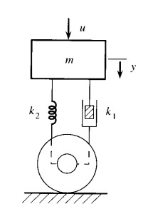
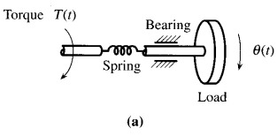
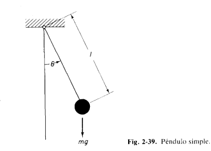

# Sistemas Dinamicos
Los sistemas dinamicos son aquellos cuyos estados van variando en el tiempo en respuestas a entradas o perturvaciones externas sistemas dinamico.
El estudio de sistemas dinámicos es indispensable para el diseño y análisis de sistemas de control, para asi predecir su comportamiento ante diferentes condiciones,perturvaciones  y garantinzar su rendimiento de una manera mas optima.

El modelado matemático de un sistema dinámico consiste en describir su comportamiento mediante ecuaciones diferenciales, obtenidas a partir de leyes físicas fundamentales como:

🔹Leyes de Newton en sistemas mecánicos.

🔹Leyes de Kirchhoff en sistemas eléctricos.

🔹Principios de conservación de energía y masa en sistemas térmicos e hidráulicos.

# Sistemas Mecanicos 
Para modelar sistemas mecanicos necesitamos tener un conocimiento basico de la mecanica clasica y las ley Newton,tambien tener conocimiento sobre matematicas para poder resolver ecuaciones diferenciales para comprender el sistema.En los sistemas Mecanicos tendremos sistemas de describen la corelacion entre fuera, desplazamiento, friccion, velocidades y aceleracion. Tener estos conocimientos y poder hacer el modelamiento del sistema es muy util ya que nos permite poder evaluar el comportamiento y funcionamiento de un sistema antes de su implementacion fisica.
## 1. Masa Resorte Amortiguador
Este sistema es un modelo que usamos para estudiar el comportamiento de los sistemas mecanicos cuando estan expuestos a un movimiento.En sistemas de control es un modelo que representa un sistema dinamico de segundo orden, el cual nos sirve para enteder la estabilidad y el comportamiento fisico ante perturbaciones externas, en este sistemas en espesifico la masa representa la inercia, el resorte representa la elasticidad y el amortiguador introduce disipacion de la energia.
Este sistema se describe mediante una ecuacion diferencial lineal, que nos permite diseñar controladores que regulen su comportamiento y ayudar a prevenir las oscilaciones y tener un sistema mas estable que es lo que siempre se busca.

La ecuacion de un sistema masa-resorte-amortiguador es:

$$
F_R = k_2 \cdot x
$$

$$
F_F = k_1 \cdot v_m
$$

$$
F = m \cdot a
$$

Donde:  
- \( F_R \) es la fuerza del resorte.  
- \( F_F \) es la fuerza de fricción viscosa.  
- \( F \) es la fuerza neta aplicada.  
- \( k_2 \) es la constante del resorte.  
- \( k_1 \) es el coeficiente de amortiguamiento.  
- \( v_m \) es la velocidad de la masa.  
- \( m \) es la masa.  
- \( a \) es la aceleración.  

Como ya se habia mencionado anteriormente este sistema cueta con 3 principales componentes que se van a describir a continuacion.

### 🔑 1.1. Masa (m)
Es el objeto que se mueve, tiene inercia esto quiere decir que resiste cambios en su movimiento.

Almacena energia cinetica cuando esta en movimiento.

### 🔑 1.2. Resorte (k)
Es aquel que se estira o se comprime.

Sigue la Ley de Hooke en la cual k es la constante del resorte,x cuando se estira o se comprime 

### 🔑 1.3. Amortiguador (c)
Hace referencia a un piston que frena el movimiento.

La fuerza que hace depende de la velocidad.

Disipa energia en forma de calor.

## 3. Ejemplos
💡**Ejemplo 1:** # Modelo Matemático

.

El sistema está compuesto por una masa \( m \) que representa el chasis del vehículo, un resorte con constante        \( k_2 \), y un amortiguador con coeficiente \( k_1 \). También se considera una fuerza de entrada \( u(t) \).

## Ecuación de Movimiento

Aplicando la Segunda Ley de Newton:

$$u(t) + F_w - F_R - F_F = m \cdot a$$

Sustituyendo las expresiones para cada fuerza:

$$- u(t) + mg - k_2 y(t) - k_1 y'(t) = m y''(t)$$

Donde:
-\( u(t) \) es la entrada al sistema.
- \( mg \) es la fuerza gravitacional.
- \( k_2 y(t) \) es la fuerza restauradora del resorte.
- \( k_1 y'(t) \) es la fuerza de amortiguamiento.
- \( y''(t) \) es la aceleración del sistema.

2.# **Sistemas Mecánicos Rotacionales**  

Para modelar sistemas mecánicos rotacionales, es necesario comprender la dinámica del movimiento angular y aplicar las leyes de Newton en su versión rotacional. Estos sistemas incluyen parámetros como el momento de inercia, el par de torsión, la rigidez rotacional y el amortiguamiento rotacional.

El sistema rotacional se describe mediante la siguiente ecuación diferencial, derivada de la Segunda Ley de Newton para el movimiento rotacional:

$$\[T - B_r \cdot \theta' - K_r \cdot \theta = J \cdot \theta''\]$$

Donde:
- \( T \) es el torque aplicado al sistema.  
- \( B_r \) es el coeficiente de amortiguamiento rotacional.  
- \( K_r \) es la constante de rigidez rotacional.  
- \( J \) es el momento de inercia.  
- \( \theta \) es el desplazamiento angular.  
- \( \theta' \) es la velocidad angular.  
- \( \theta'' \) es la aceleración angular.  

---

## **Elementos del Sistema Rotacional**  

### 🔑 2.1. Momento de Inercia J  
Representa la resistencia del cuerpo a los cambios en su estado de movimiento rotacional. Se expresa como:  

$$\[J = \sum m_i r_i^2\]$$

Donde \( m_i \) son las masas de las partículas y \( r_i \) sus respectivas distancias al eje de rotación.

---

### 🔑 **2.2. Resorte de Torsión Kr**  
Es el equivalente a un resorte en un sistema lineal, pero aplicado a la torsión. Su ecuación se basa en el ángulo de torsión:

$$\[T = K_r \cdot \theta\]$$

Donde \( K_r \) es la constante de torsión y \( \theta \) es el desplazamiento angular.

---

### 🔑 **2.3. Amortiguador Rotacional Br**  
Dissipa energía en el sistema y se modela como una resistencia proporcional a la velocidad angular:

$$\[T_f = B_r \cdot \theta'\]$$

Donde \( T_f \) es el torque de fricción y \( \theta' \) es la velocidad angular.

---

## **4. Ejemplo de un Sistema Rotacional**  
 💡 **Ejemplo 2:** **Sistema de Rueda y Eje**  
 El siguiente sistema representa un **modelo rotacional** con un **momento de inercia** \( J \), un **resorte de torsión** con constante \( k \), y un **amortiguador rotacional** con coeficiente \( b \). También se considera un **torque externo** \( T(t) \).  

 

La ecuación diferencial que rige el comportamiento de este sistema es:

$$J \cdot \frac{d^2\varphi}{dt^2} + b \cdot \frac{d\varphi}{dt} + k \cdot \varphi = T(t)$$

Este modelo permite analizar la dinámica del sistema y diseñar controles para su estabilidad y desempeño.

## 6. Ejercicios
 📚 Sistemas Mecanicos

 

# 📌 Problema: Péndulo Simple  

Un péndulo simple consiste en una esfera de masa \( m \) suspendida por una cuerda de masa despreciable y longitud \( l \). Se desprecia la fricción y la elasticidad de la cuerda.  

Se busca:  
1. La ecuación de movimiento del péndulo.  
2. La frecuencia natural del sistema cuando \( \theta \) es pequeño.  

---

## 🔹 **Análisis del Problema**  

La fuerza gravitacional \( mg \) tiene dos componentes:  
- **Tangencial**: \( mg \sin \theta \).  
- **Normal**: \( mg \cos \theta \).  

El par debido a la componente tangencial de \( mg \) es:  

$$T = -mgl \sin \theta$$

Aplicando la segunda ley de Newton en forma rotacional:  

$$J \ddot{\theta} = -mgl \sin \theta$$

Donde el **momento de inercia** respecto al punto de suspensión es:  

$$J = ml^2$$

Por lo tanto, la ecuación de movimiento se reescribe como:  

$$ml^2 \ddot{\theta} + mgl \sin \theta = 0$$

Dividiendo entre \( ml^2 \):  

$$\ddot{\theta} + \frac{g}{l} \sin \theta = 0$$

---

## 🔹 **Aproximación para Ángulos Pequeños**  

Para valores pequeños de $$\theta \$$, se puede usar la aproximación:  

$$\sin \theta \approx \theta$$

Sustituyendo en la ecuación de movimiento:  

$$\ddot{\theta} + \frac{g}{l} \theta = 0$$

---

## 🔹 **Frecuencia Natural**  

Esta es una ecuación diferencial de un **oscilador armónico simple**, cuya **frecuencia natural** es:  

$$\omega_n = \sqrt{\frac{g}{l}}$$

---

## 🔹 **Resumen de Resultados**  

- **Ecuación de movimiento exacta**:  

  $$\ddot{\theta} + \frac{g}{l} \sin \theta = 0$$

- **Ecuación de movimiento aproximada para \( \theta \) pequeño**:  

  $$\ddot{\theta} + \frac{g}{l} \theta = 0$$

- **Frecuencia natural**:  

  $$\omega_n = \sqrt{\frac{g}{l}}$$

 📚 Sistemas Rotacionales
## 7. Conclusiones
Agregue unas breves conclusiones sobre los temas trabajados en cada clase, puede ser a modo de resumen de lo trabajado o a indicando lo aprendido en cada clase

## 8. Referencias
Agregue un subtítulo al final donde pueda poner todas las referencias consultadas incluyendo el origen o fuente de los ejercicios planteados. Tambien dentro del texto referencie los textos o artículos consultados y las figuras y tablas dentro de la explicación de las mismas.
