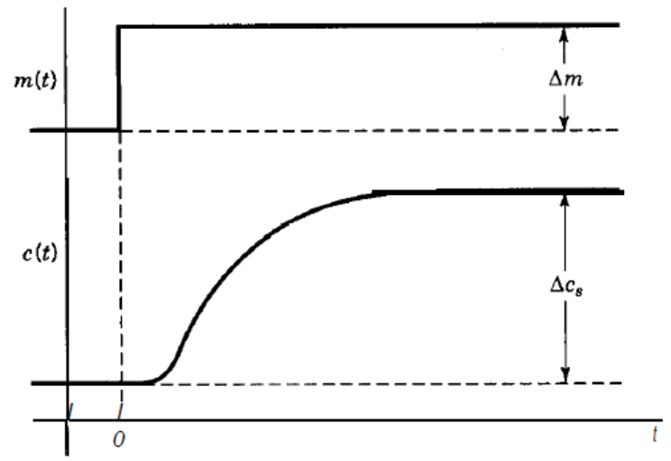
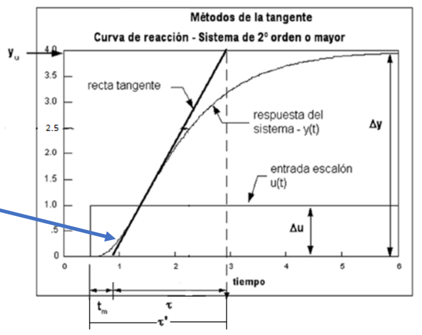
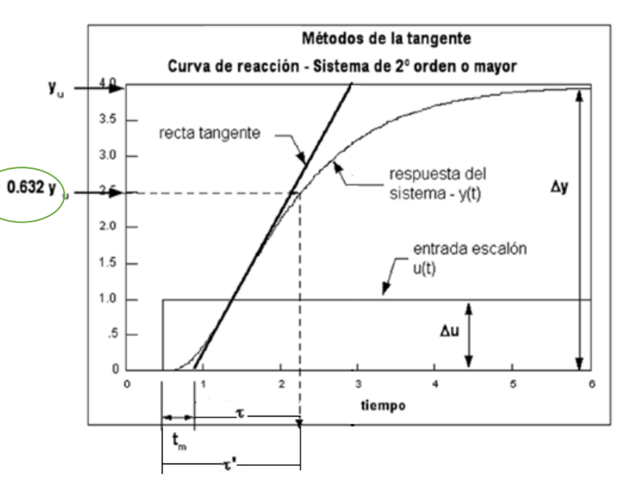
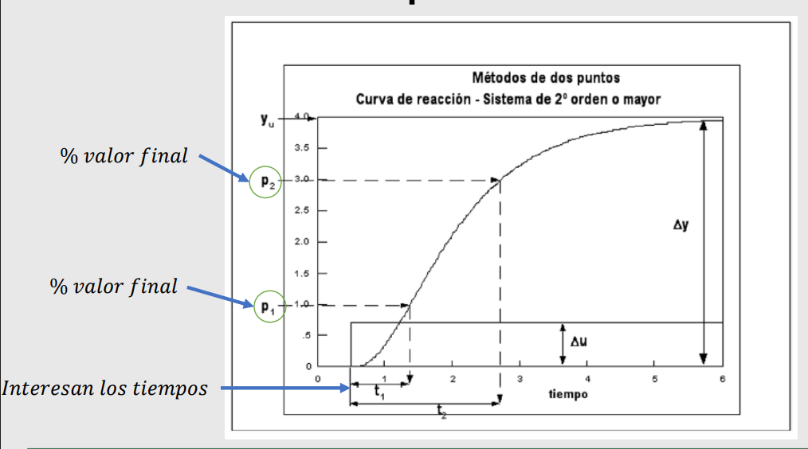
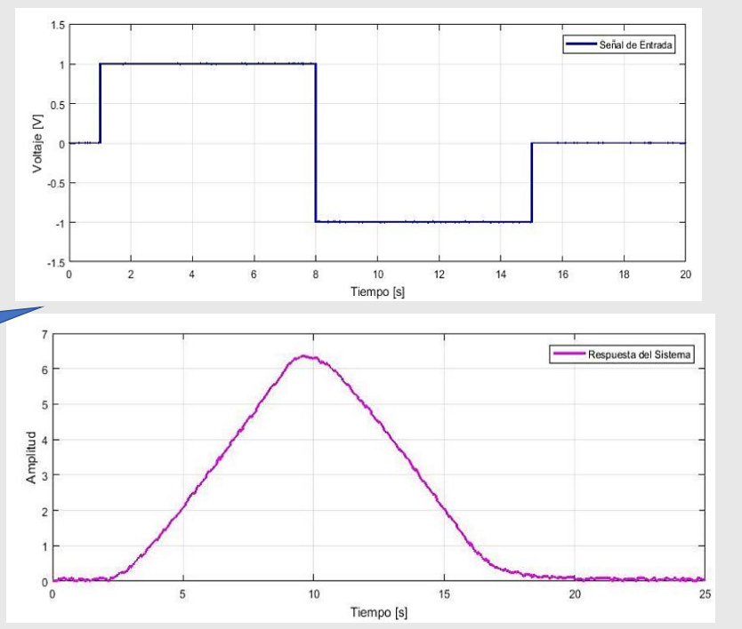

# Identificación de Sistemas

## 1. Introducción

En el vasto y complejo campo de la ingeniería de control, la sintonización precisa y efectiva de los controladores es una tarea de importancia capital para asegurar el rendimiento óptimo, la estabilidad y la eficiencia de cualquier sistema dinámico. Antes de embarcarse en el diseño y la implementación de un controlador eficaz, resulta indispensable adquirir un conocimiento profundo del comportamiento dinámico inherente a la planta o proceso con el que se va a trabajar. La identificación de sistemas emerge, en este contexto, como una disciplina ingenieril de inestimable valor, cuyo objetivo primordial es la obtención de modelos matemáticos que describan con fidelidad la relación causa-efecto entre las entradas aplicadas a un sistema y las salidas observadas.

Existen diversas aproximaciones y metodologías para lograr esta identificación, cada una con sus propias ventajas y dominios de aplicación. Estas varían desde la rigurosa derivación de modelos matemáticos fundamentados en principios físicos y expresados mediante ecuaciones diferenciales, hasta el análisis en el dominio de la frecuencia, o incluso la aplicación de técnicas avanzadas y de vanguardia provenientes del campo de la inteligencia computacional, tales como redes neuronales o algoritmos genéticos. Sin embargo, en el ámbito industrial, donde la pragmática y la eficiencia en la implementación son a menudo consideraciones prioritarias, se recurre con notable frecuencia a metodologías empíricas y de carácter experimental para obtener modelos aproximados, que si bien no son exactos, son suficientemente precisos para la tarea de sintonización de controladores.

Una de las técnicas más extendidas, versátiles y prácticas para esta tarea de identificación empírica es el análisis de sistemas mediante curvas de reacción, un método particularmente adecuado y eficaz para sistemas que pueden ser aproximados como de primer orden con tiempo muerto. Este enfoque se fundamenta en la observación y el análisis detallado de la respuesta temporal del sistema ante la aplicación de una entrada de prueba estandarizada, comúnmente una señal tipo escalón. A partir de esta respuesta, es posible extraer de manera sistemática una serie de parámetros clave que caracterizan y definen la dinámica fundamental de la planta. A lo largo de este informe, se explorarán en profundidad estas metodologías de identificación, detallando sus principios operativos, sus aplicaciones más comunes en la industria, así como sus inherentes ventajas y limitaciones, buscando proporcionar una visión integral, clara y concisa de su utilidad práctica en el diseño, la optimización y el mantenimiento de sistemas de control eficientes y robustos.

## 2. Metodologías de Identificación de Sistemas

La identificación de sistemas es un proceso de ingeniería esencial y fundamental para cualquier tarea que implique la sintonización o el diseño de un controlador automático. Su propósito primordial es la obtención de un modelo matemático, o una representación simplificada, que sea capaz de emular y predecir el comportamiento dinámico de una planta o proceso bajo estudio. Comprender cómo un sistema reacciona a diferentes estímulos es el primer paso crítico para poder manipularlo y controlarlo de manera efectiva.

Las formas más comunes y aceptadas para obtener este modelo incluyen:

* **Modelo matemático basado en Ecuaciones Diferenciales:** Este enfoque implica la aplicación de leyes fundamentales de la física para derivar un conjunto de ecuaciones diferenciales que describen el comportamiento dinámico del sistema.
* **Curvas de reacción en lazo abierto:** Esta metodología, que será el foco principal de este informe, es de carácter empírico. Consiste en aplicar una señal de prueba conocida (usualmente un escalón) al sistema operando en lazo abierto y registrar su respuesta de salida.
* **Identificación de parámetros en lazo cerrado:** Aquí la identificación se realiza mientras el sistema está operando bajo control, es decir, en lazo cerrado.
* **Análisis en frecuencia:** Este método implica la excitación del sistema con señales sinusoidales de diferentes frecuencias y la medición de la amplitud y el desfase de la respuesta de salida.
* **Técnicas de inteligencia computacional:** Métodos más modernos y avanzados que utilizan algoritmos de aprendizaje automático, redes neuronales, lógica difusa o algoritmos genéticos.

### 2.1. Metodologías Empíricas

Es fundamental comprender que las metodologías empíricas en la identificación de sistemas no son sinónimo de un proceso desordenado de "prueba y error" sin fundamento. Por el contrario, representan enfoques sistemáticos y estructurados diseñados para inferir el comportamiento dinámico de un sistema a partir de datos experimentales recopilados durante pruebas realizadas directamente sobre la planta real.

Generalmente, las metodologías empíricas de identificación de sistemas involucran una combinación de los siguientes aspectos fundamentales:

* **Manejo de datos:** Recolección, almacenamiento, limpieza y pre-procesamiento de los datos de entrada y salida del sistema.
* **Estadística:** Utilización de herramientas estadísticas para analizar las relaciones entre las variables, cuantificar la incertidumbre del modelo y validar su ajuste.
* **Señales:** Selección y aplicación de señales de prueba adecuadas (como escalones, impulsos, rampas o secuencias pseudoaleatorias binarias).

### 2.2. Metodologías de Curvas de Reacción en Lazo Abierto

Dentro del espectro de las metodologías empíricas, las técnicas basadas en curvas de reacción en lazo abierto son particularmente valiosas y ampliamente adoptadas en la industria debido a su simplicidad conceptual y su eficacia. Estas metodologías permiten obtener un modelo aproximado de la dinámica del sistema, generalmente representado como un sistema de primer orden más tiempo muerto. La forma general de la función de transferencia de este modelo es la siguiente:

$$G(s)=\frac{ke^{-st_{0}}}{\tau s+1}$$

Donde cada uno de los parámetros tiene un significado físico y dinámico específico:

* $\tau \rightarrow$ **Constante de tiempo del sistema:** Representa la rapidez con la que el sistema responde a un cambio en la entrada.
* $k \rightarrow$ **Ganancia estática del sistema:** Describe la relación entre el cambio en la salida del sistema y el cambio en la entrada, una vez que el sistema ha alcanzado un nuevo estado estacionario.
* $t_{o} \rightarrow$ **Tiempo Muerto (o Retardo de Transporte):** Representa el tiempo que transcurre entre el momento en que se aplica un cambio en la entrada y el momento en que la salida del sistema comienza a reaccionar.

La esencia de estas metodologías radica en la capacidad de obtener los valores de estos parámetros ($t_o$, $\tau$ y $k$) directamente a partir del análisis de la respuesta temporal de la planta.

#### Aplicación de Curvas de Reacción en Lazo Abierto

Para la aplicación exitosa de estas metodologías de identificación, es fundamental considerar y cumplir ciertas condiciones operativas, así como seguir un procedimiento estandarizado:

* **Condiciones para su aplicación:**
    * **El sistema debe ser estable en lazo abierto.**
    * **El sistema debe tener un comportamiento sobre o críticamente amortiguado.**
* **Prueba para obtener la respuesta:**
    * **Aplicación de una entrada escalón y captura de datos.**
    * **Captura de la respuesta:** Mediante osciloscopios, tarjetas de adquisición de datos (DAQ), o microcontroladores (Arduino, Raspberry Pi, PLC).

Una vez obtenida la curva de reacción, como la que se ilustra a continuación, se procede a la extracción de los parámetros mediante los métodos específicos de identificación.

.
Figura 1. Curva de reacción típica a una entrada escalón.

### 2.3. Método de Ziegler & Nichols (Recta Tangente)

El método de la recta tangente, propuesto por Ziegler y Nichols en la década de 1940, se basa en un análisis gráfico directo de la curva de reacción.

El procedimiento consiste en:

1.  **Identificar el punto de inflexión.**
2.  **Trazar una recta tangente** en su punto de inflexión.
3.  **Extrapolar la recta tangente** hasta que intersecte el eje del tiempo y la línea del valor final.

A partir de esta recta tangente y la curva de reacción, se pueden determinar los parámetros clave:

* $t_{m} = \text{cruce de la recta tangente con el eje del tiempo}$
* $\tau = \tau' - t_{m}$
* $K = \frac{\Delta y}{\Delta u}$

Figura 2. Método de la recta tangente de Ziegler & Nichols.
  
Este método presenta una limitación: la obtención de los parámetros puede ser sensible a la precisión con la que se traza la recta tangente, lo que afecta la repetibilidad.

### 2.4. Método Modificado de Miller

El método modificado de Miller fue desarrollado para subsanar la limitación de repetibilidad del método de Ziegler & Nichols. Introduce una forma más sistemática para la identificación de la constante de tiempo.

El procedimiento para el método modificado de Miller es el siguiente:

1.  **Identificar el punto de inflexión y trazar la recta tangente.**
2.  **Determinar el tiempo muerto ($t_o$):** Es el punto donde la recta tangente intersecta el eje del tiempo o el valor inicial de la salida.
3.  **Identificar el tiempo para el 63.2% del cambio total:** Se calcula el valor de la salida que corresponde al 63.2% de $\Delta y$, y se localiza el tiempo ($t_{63.2}$) en el que la salida alcanza este valor.
4.  **Calcular la constante de tiempo ($\tau$):**
    $$\tau = t_{63.2} - t_o$$
5.  **Calcular la ganancia estática ($K$):**
    $$K = \frac{\Delta y}{\Delta u}$$

Figura 3. Método modificado de Miller.

La gran ventaja del método modificado de Miller es la mejora en la repetibilidad del modelo obtenido, al basar el cálculo de $\tau$ en un porcentaje fijo de la respuesta final.

### 2.5. Métodos de Identificación de 2 Puntos

Las imprecisiones de los métodos basados en la recta tangente llevaron al desarrollo de los métodos de identificación de 2 puntos, que utilizan dos puntos de referencia discretos y predefinidos en la curva de reacción para la extracción de los parámetros del modelo. Esto conduce a modelos más consistentes y repetibles.

El modelo que se busca aproximar sigue siendo el de primer orden más tiempo muerto:

$$G(s)=\frac{ke^{-st_{0}}}{\tau s+1}$$

Las ecuaciones generales para el cálculo de la constante de tiempo ($\tau$) y el tiempo muerto ($t_o$) son lineales:

$$\tau = At_1 + Bt_2$$
$$t_o = Ct_1 + Dt_2$$

Donde $t_1$ y $t_2$ son los tiempos en los que la salida alcanza los porcentajes predefinidos ($%p1, %p2$) de su cambio total.

La ganancia estática ($K$) se calcula de la misma forma:

$$K = \frac{\Delta y}{\Delta u}$$

La siguiente tabla resume las constantes específicas y los porcentajes para algunos métodos de 2 puntos para modelos de primer orden con tiempo muerto:

| Método    | %p1($t_1$) | %p2($t_2$) | A      | B      | C     | D      |
| :-------- | :--------- | :--------- | :----- | :----- | :---- | :----- |
| Alfaro    | 25.0       | 75.0       | -0.910 | 0.910  | 1.262 | -0.262 |
| Bröida    | 28.0       | 40.0       | -5.500 | 5.500  | 2.800 | -1.800 |
| Chen y Yang | 33.0     | 67.0       | -1.400 | 1.400  | 1.540 | -0.540 |
| Ho et al. | 35.0       | 85.0       | -0.670 | 0.670  | 1.300 | -0.300 |
| Smith     | 28.3       | 63.2       | -1.500 | 1.500  | 1.500 | -0.500 |

Figura 4. Métodos de 2 puntos para la identificación de sistemas.

### 2.6. Método de 2 puntos Segundo orden (Viteckova)

Las metodologías de identificación de 2 puntos también pueden extenderse para obtener modelos de funciones de transferencia de **segundo orden más tiempo muerto**.

El modelo general de segundo orden más tiempo muerto que se busca aproximar es:

$$G(s)=\frac{k \cdot e^{-t_{o}s}}{(\tau s+1)(\tau s+1)} = \frac{k \cdot e^{-t_{o}s}}{(\tau s+1)^2}$$

Las ecuaciones para calcular la constante de tiempo ($\tau$) y el tiempo muerto ($t_o$) son:

$$\tau=At_{1}+Bt_{2}$$
$$t_{o}=Ct_{1}+Dt_{2}$$

La ganancia $K$ se calcula de la misma forma:

$$K = \frac{\Delta y}{\Delta u}$$

Para el método de **Viteckova**, las constantes específicas y los porcentajes de los puntos de referencia son:

| Método    | %p1($t_1$) | %p2($t_2$) | A      | B      | C     | D      |
| :-------- | :--------- | :--------- | :----- | :----- | :---- | :----- |
| Viteckova | 33.0       | 70.0       | -0.749 | 0.749  | 1.937 | -0.937 |

### 2.7. Validez de los Modelos Empíricos

Los modelos obtenidos mediante estas metodologías empíricas poseen una validez inherente restringida a un **determinado punto de operación** o rango de operación, debido a la no linealidad común en los procesos industriales. Podría requerirse la identificación de **múltiples modelos** para un control óptimo en todo el rango de operación.

### 2.8. Identificación de Sistemas Inestables (Lazo Abierto)

La identificación de sistemas inherentemente inestables en lazo abierto presenta un desafío. A pesar de estas dificultades, es posible obtener modelos aproximados para ciertos tipos de sistemas inestables.

#### Aproximación FOPDTI (First-Order Plus Dead Time with Integrator)

Para abordar la identificación de sistemas inestables o integradores, se utiliza la aproximación FOPDTI:

$$G(s)=\frac{Ke^{-st_{0}}}{(\tau s+1)s}$$

La metodología implica:

1.  **Captura de la curva de reacción en lazo abierto.**
2.  **Derivación de la curva obtenida:** La derivada de la curva de reacción se asemeja a la de un sistema de primer orden con tiempo muerto.
3.  **Aproximación del resultado a un sistema de primer orden más tiempo muerto:** Se aplican los métodos de identificación de primer orden a esta curva derivada.

Figura 5. Curva de reacción de un sistema inestable y su derivada para la aproximación FOPDTI.

## 3. Ejemplos Prácticos

### 💡 Ejemplo 1: Aplicando método de Smith

Consideremos un ejemplo práctico para ilustrar la aplicación del método de Smith. Supongamos que realizamos una prueba de respuesta escalón a una planta y la salida final de la respuesta en estado estacionario es de **2 unidades** para una entrada escalón unitario.

Los puntos de referencia para el método de Smith son:
* Punto 1 (P1): 28.3% del valor final de la respuesta.
* Punto 2 (P2): 63.2% del valor final de la respuesta.

Calculamos los valores de amplitud correspondientes a estos porcentajes:
* $P1 = 2 \times 0.283 = 0.566$
* $P2 = 2 \times 0.632 = 1.264$

Ahora, observando la gráfica de la curva de reacción de la planta, ubicamos los tiempos en los que la salida alcanza estos valores específicos:
* Cuando la salida es $0.566$, el tiempo correspondiente es $t_1 = 1.67$ segundos.
* Cuando la salida es $1.264$, el tiempo correspondiente es $t_2 = 2.89$ segundos.

Figura 6. Ubicación de los puntos P1 y P2 en la curva de respuesta para el método de Smith.

A continuación, utilizamos las constantes específicas del método de Smith para el cálculo de $\tau$ y $t_o$: $A=-1.5, B=1.5, C=1.5, D=-0.5$.

Aplicamos las ecuaciones generales:
* **Constante de tiempo ($\tau$):**
    $$\tau = (-1.5)(1.67) + (1.5)(2.89) = 1.83 \text{ segundos}$$
* **Tiempo muerto ($t_o$):**
    $$t_o = (1.5)(1.67) + (-0.5)(2.89) = 1.06 \text{ segundos}$$

Finalmente, calculamos la **ganancia estática ($K$)**:
$$K = \frac{\Delta y}{\Delta u} = \frac{2 - 0}{1 - 0} = 2$$

Con estos parámetros calculados, podemos escribir la función de transferencia de primer orden más tiempo muerto que representa el modelo de la planta:

$$G(s) = 2 \times \frac{e^{-1.06s}}{1.83s+1}$$

Figura 7. Comparación del modelo de primer orden obtenido por el método de Smith con la curva de reacción original.

### 💡 Ejemplo 2: Identificación de sistema de segundo orden con Viteckova

Consideremos un sistema cuya respuesta a una entrada escalón muestra un valor final en estado estacionario de **3 unidades**. Aplicaremos el método de Viteckova para identificar un modelo de segundo orden más tiempo muerto.

Los puntos de referencia para el método de Viteckova son:
* Punto 1 (P1): 33% del valor final de la respuesta.
* Punto 2 (P2): 70% del valor final de la respuesta.

Calculamos los valores de amplitud correspondientes a estos porcentajes:
* $P1 = 3 \times 0.33 = 0.99$
* $P2 = 3 \times 0.70 = 2.1$

De la gráfica de la curva de reacción del sistema, ubicamos los tiempos en los que la salida alcanza estos valores:
* Cuando la salida es $0.99$, el tiempo correspondiente es $t_1 = 1.81$ segundos.
* Cuando la salida es $2.1$, el tiempo correspondiente es $t_2 = 3.29$ segundos.

Figura 8. Ubicación de los puntos P1 y P2 en la curva de respuesta para el método de Viteckova.

Utilizamos las constantes del método de Viteckova: $A=-0.749, B=0.749, C=1.937, D=-0.937$.

Aplicamos las ecuaciones para calcular $\tau$ y $t_o$:
* **Constante de tiempo ($\tau$):**
    $$\tau = (-0.749)(1.81) + (0.749)(3.29) = 1.1085 \text{ segundos} \approx 1.1 \text{ segundos}$$
* **Tiempo muerto ($t_o$):**
    $$t_o = (1.937)(1.81) + (-0.937)(3.29) = 0.4241 \text{ segundos} \approx 0.423 \text{ segundos}$$

**Cálculo de la ganancia estática ($K$):**
Asumiendo una entrada escalón unitario ($\Delta u = 1$):
$$\Delta y = 3 - 0 = 3 \text{ unidades}$$
$$K = \frac{3}{1} = 3$$

**Expresión de la Función de Transferencia:**
Con los valores calculados:
$$G(s) = \frac{3e^{-0.423s}}{(1.1s+1)(1.1s+1)} = \frac{3e^{-0.423s}}{1.21s^2 + 2.2s + 1}$$

Figura 9. Comparación del modelo de segundo orden obtenido por el método de Viteckova con la curva de reacción original.

## 4. Ejercicios Propuestos

### 📚 Ejercicio 1: Cálculo de parámetros con el método de Smith

Un ingeniero mecatrónico realiza una prueba de respuesta escalón a un sistema en lazo abierto y obtiene la siguiente curva de reacción. Se determina que el valor final de la respuesta es 1.5. Utilizando el método de Smith, determine la constante de tiempo ($\tau$), el tiempo muerto ($t_o$) y la ganancia ($K$) del sistema, y exprese la función de transferencia de primer orden más tiempo muerto.
Los puntos de interés obtenidos de la curva son:

* El 28.3% del valor final se alcanza en $t_1 = 1.0$ segundos.
* El 63.2% del valor final se alcanza en $t_2 = 2.0$ segundos.

**Solución:**
Primero, calculamos los valores de amplitud en los puntos P1 y P2:

* $P1 = 1.5 \times 0.283 = 0.4245$
* $P2 = 1.5 \times 0.632 = 0.948$

Las constantes para el método de Smith son: $A=-1.5, B=1.5, C=1.5, D=-0.5$.
Ahora, calculamos $\tau$ y $t_o$:

* $\tau = (-1.5)(1.0) + (1.5)(2.0) = -1.5 + 3.0 = 1.5$ segundos
* $t_o = (1.5)(1.0) + (-0.5)(2.0) = 1.5 - 1.0 = 0.5$ segundos

La ganancia $K$ se calcula como el cambio en la salida dividido por el cambio en la entrada. Asumiendo una entrada escalón unitario (cambio de 1):

$$K = \frac{1.5 - 0}{1 - 0} = 1.5$$

Finalmente, la función de transferencia de primer orden más tiempo muerto es:

$$G(s) = \frac{1.5e^{-0.5s}}{1.5s+1}$$

### 📚 Ejercicio 2: Identificación de sistema de segundo orden con Viteckova

Se realiza una prueba de respuesta escalón a un sistema y se observa un valor final de la respuesta de 3. Utilizando el método de Viteckova para identificar un modelo de segundo orden más tiempo muerto, y con los siguientes tiempos obtenidos de la curva de reacción:

* El 33% del valor final se alcanza en $t_1 = 1.81$ segundos.
* El 70% del valor final se alcanza en $t_2 = 3.29$ segundos.

Determine la constante de tiempo ($\tau$), el tiempo muerto ($t_o$) y la ganancia ($K$), y exprese la función de transferencia de segundo orden más tiempo muerto.
**Solución:**
Primero, calculamos los valores de amplitud en los puntos P1 y P2:

* $P1 = 3 \times 0.33 = 0.99$
* $P2 = 3 \times 0.70 = 2.1$

Las constantes para el método de Viteckova son: $A=-0.749, B=0.749, C=1.937, D=-0.937$.
Ahora, calculamos $\tau$ y $t_o$:

* $\tau = (-0.749)(1.81) + (0.749)(3.29) = 1.1085$ segundos
* $t_o = (1.937)(1.81) + (-0.937)(3.29) = 0.4241$ segundos

La ganancia $K$ se calcula de manera similar:

$$K = \frac{3 - 0}{1 - 0} = 3$$

Finalmente, la función de transferencia de segundo orden más tiempo muerto es:

$$G(s) = \frac{3e^{-0.423s}}{(1.1s+1)(1.1s+1)}$$Desarrollando el denominador:$$G(s) = \frac{3e^{-0.423s}}{1.21s^2 + 2.2s + 1}$$

## 5. Conclusiones

La identificación de sistemas mediante el análisis de curvas de reacción se consolida como una herramienta invaluable y extremadamente pragmática en el ámbito de la ingeniería de control, siendo un pilar fundamental para la sintonización eficaz y eficiente de controladores, particularmente en los complejos entornos industriales donde la simplicidad operativa, la robustez y la eficiencia en la implementación son factores prioritarios.

La evolución de estas técnicas hacia los más sofisticados métodos de 2 puntos ha marcado un avance significativo. Al utilizar dos puntos de referencia discretos y predefinidos en la curva de reacción, se logra una mayor precisión y consistencia en la representación de la respuesta dinámica del sistema. Esta mejora no solo abarca la identificación de modelos de primer orden con tiempo muerto, sino que también se extiende a la posibilidad de obtener modelos de segundo orden con tiempo muerto, permitiendo así capturar dinámicas más complejas.

Es crucial asimilar que los modelos obtenidos de un sistema mediante estas metodologías empíricas son, por naturaleza, aproximaciones y, por lo tanto, poseen una validez inherente restringida a un determinado punto o rango de operación. Dada la prevalencia de la no linealidad en la mayoría de los sistemas industriales, es fundamental entender que las características dinámicas de una planta pueden variar significativamente con las condiciones operativas.

Finalmente, hemos resaltado la versatilidad de estas técnicas al considerar su aplicabilidad a sistemas intrínsecamente inestables en lazo abierto. Mediante aproximaciones ingeniosas como la metodología FOPDTI (First-Order Plus Dead Time with Integrator), se demuestra que, incluso para sistemas que no se estabilizan por sí mismos, es posible obtener modelos empíricos que, aunque sean aproximaciones, son suficientemente informativos para el diseño de controladores capaces de estabilizar y regular el proceso.

## 6. Referencias

* Pearson. Ing. Jorge Eduardo Cote Ballesteros (2023)
* N. Nise, *Control System Engineering*, 6th edition. John Wiley Editorial.
* Dorf, R., Bishop, R (2005). *Sistemas de control moderno* (10.a ed.). Madrid, España: Pearson Educacion.
* Ogata, K. *Ingeniería de Control Moderna*. 5 edición. Prentice Hall.
