# SincronizaciÓn PID lazo abierto

## 1. Introducción 

El diseño de controladores es fundamental en la ingeniería de control para automatizar procesos y hacerlos funcionar correcta y eficientemente. Uno de los métodos de esta área de estudio es diseñar controladores de tipo PID (Proporcional, integral y derivativo), debido a su sencilles y efectividad que mejora el comportamiento de nuestros sistemas. Los controladores tienen dos formas de funcionar, las cuales son con retroalimentación (Lazo cerrado) y sin retroalimentación (Lazo abierto). Cuando hablados de diseño de controladores en lazo abierto, nos referimos a cuando el controlador hace su trabajo sin tener en cuenta la retroalimentación del sistema durante su proceso. La sincronización PID en lazo abierto nos permite calcular varios de los parámetros de forma más directa, aprovechando herramientas tales como frecuencia, ubicación de polos o ajustes en base al comportamiento deseado.

En la clase se explicaron fundamentos del PID por cada una de sus partes, y como en base a cada uno de sus componentes nuestro sistema va a variar, como por ejemplo en nuestro tiempo de respuesta, oscilaciones, estabilidad y en el error estacionario; así como se describieron las ventajas y desventajas que se pueden presentar al usar este método de sincronización. En el siguiente resumen se explicará el tema trabajado en la clase de sincronización de PID en lazo abierto describiendo las acciones del controlador, sus tipos de arquitectura, como lograr la sincronización en lazo abierto y algunos de los métodos para probar esto.

## 2. Acciones de control

### 2.1. Acción proporcional

La acción proporcional se llama así, debido a que esta es proporcional a la señal del error. Esta multiplica nuestra señal del error por una ganancia Kp que determina cuanta será esta acción del controlador, por lo que podemos inferir que esta es útil cuando se tiene un solo error en el sistema. Como es una multiplicación la ecuación que representa lo que pasa en la acción proporcional es la siguiente:

$$u(t) = Kp * e(t)$$
$$U(S) = Kp * E(S)$$

Cuando aumentamos la acción proporcional nos ocurrirá lo siguiente:

- Aumenta la velocidad del sistema
- Disminuye el error del sistema
- El sistema se vuelve más inestable

### 2.2. Acción integral 

La acción integral se puede describir como la suma o acumulación de la señal del error; esto debido a que toma esta señal y la integra para que mientras se observa el sistema con esta acción después de un tiempo se podrán ver pequeños errores que se sumaran haciendo que la acción integral sea mayor. Por lo tanto, si nuestro error tiende a cero esta acción lo disminuye cada vez más, hasta que llegue a cero. Por lo que las fórmulas son las siguientes:

$$u(t) = K_{i} \int  e(t)dt$$
$$U(S) = K_{i} * \frac{E(S)}{S}$$

Cuando aumentamos la acción integral pasar lo siguiente:

- Disminuye el error en régimen permanente
- Aumenta la velocidad del sistema
- El sistema se vuelve más inestable

### 2.3. Acción derivativa 

La acción derivativa es proporcional a la derivada de la señal del error, por lo que tendremos una ganancia Kd que multiplicaremos por el error para poder disminuir las variaciones del error en el sistema. Como es una multiplicación la fórmula es la siguiente:

$$u(t) = K_{d} * \frac{de(t)}{dt}$$
$$U(S) = K_{d} * sE(S)$$

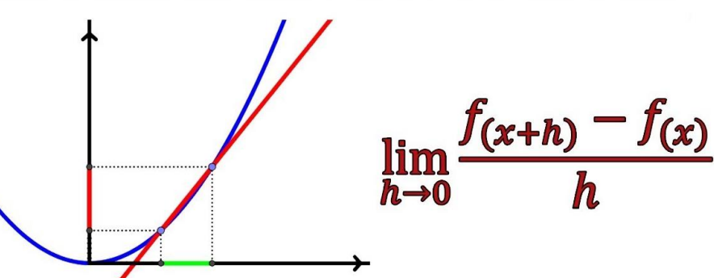.

Figura 1. Grafica curva accion derivativa

Aumentar la constante derivativa tiene los siguientes efectos en el sistema:

- Aumenta la estabilidad del sistema
- El error en régimen permanente funciona igual
- Disminuye la velocidad del sistema

## 3. Arquitecturas PID

La arquitectura PID es aquella que nos permite combinar de diferentes maneras las acciones de control (Proporcional, Integral y Derivativa). A continuación se verán las 3 arquitecturas clásicas.

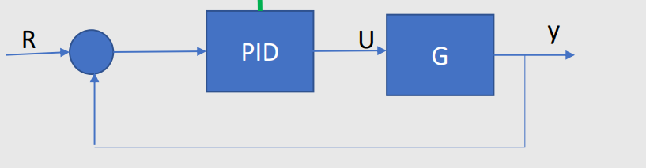.

Figura 2. Diagrama de bloques controlador PID.

### 3.1. Arquitectura paralela 

Lo que se hace en la arquitectura paralela es tomar nuestra tres acciones de control, sumarlas directamente y multiplicarlas por el error, para después sumar nuestro controlador PID a nuestra función de transferencia para estabilizar el sistema.

$$U(S) = Kp * E(S) + K_{i} * \frac{E(S)}{S} +  K_{d} * sE(S)$$
$$u(t) = Kp * e(t) + K_{i} \int  e(t)dt + K_{d} * \frac{de(t)}{dt}$$

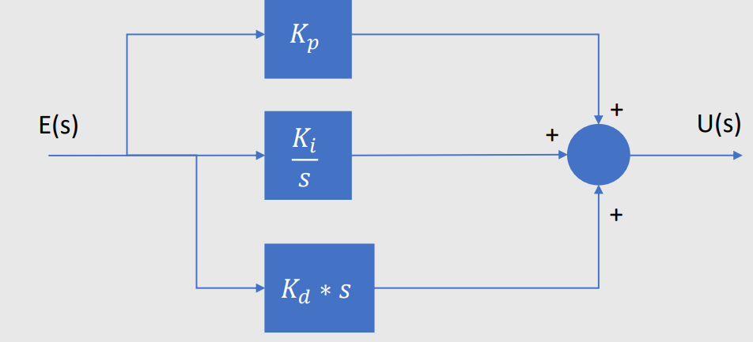.

Figura 3. Arquitectura paralela circuito. 

### 3.2. Arquitectura ideal

En la arquitectura ideal lo que se hace es multiplicar el error por la suma de nuestras acciones integral y derivativa, para despues multiplicar esta señal por nuestra accion proporcional. Esto se hace por que al multiplicar nuestro error por nuestra accion proporcional se vuelve muy grande, por lo que al mutiplicarlo primero por las otras dos acciones este se vuelve menos significativo.

$$U(s) = Kp * (E(s) + \frac{1}{Ti} * \frac{E(s)}{s} + Td * s * E(s))$$
$$u(t) = Kp * (e(t) + \frac{1}{Ti} * \int e(t)dt + Td\frac{de(t)}{dt} )$$

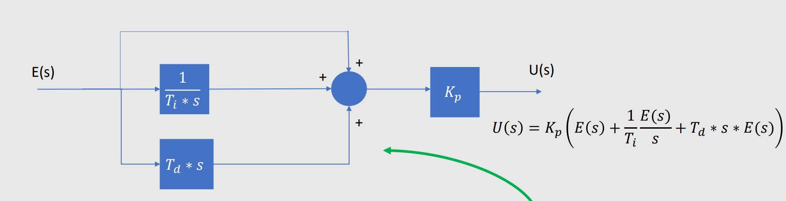.

Figura 4. Arquitectura ideal circuito.

### 3.3. Arquitectura serie

La arquitectura en serie es la es la que mejor funciona cuando queremos hacer un control PID, pero por lo mismo es la más compleja de todas. Esta pasa primero por la acción derivativa, para después multiplicarla por la acción derivativa y la acción integral después de pasar por el diagrama de bloques como se muestra en la figura 6

$$U(s) = ((E(s)(1 + Td * s))Kp)(1 + \frac{1}{Ti * s})$$
$$u(t) = \frac{1}{Ti} \int ((e(t) + Td\frac{de(t)}{dt})Kp)dt$$

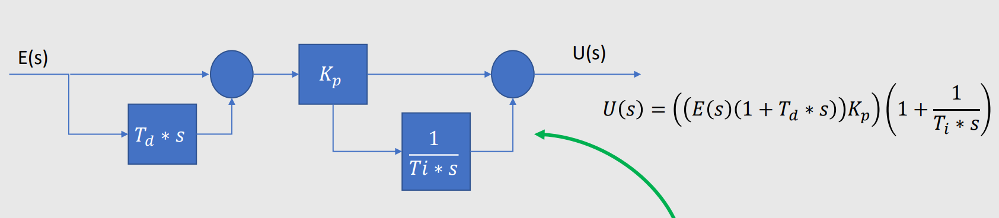.

Figura 5. Arquitectura serie circuito 

## 4. Sincronización por prueba y error

La sincronizacion por prueba y error se hace para ajustar las ganancias (Kp, Ki, Kd) para obtener la respuesta que se necesite. La metodologia que se suele utilizar es la siguiente:

- Ajustamos las ganancias Ki y Kd a cero.
- Aumentamos la ganancia Kp hasta tener el tiempo de establecimiento anhelado.
- Aumentamos Ki hasta tener el sobreimpulso anhelado.
- Aumentamos Kd hasta reducir las oscilaciones al comportamiento anhelado.
- Volvemos a ajustar la ganancia proporcional Kp.
- Ajustar las demás ganancias para que funcione óptimamente el sistema.

## 5. PID en la industria

Los controladores PID se pueden encontrar en la industria debido a su facilidad a la hora de manejar distintos sitemas, tales como presion, temperatura, velocidad, nivel, caudal etc. Estos se pueden encontrar en la industria de distintas maneras, suelen ser dispositivos fisicos que tienen tableros de control, operan mediante una interfaz con leds, pantallas LCD, botones y perillas. Cuentan con variedad de sensores, para las plantas de lazo cerrado, en donde se puede obtener una retroalimentacion para hacer funcionar los actuadores de forma correcta. Algunos ejemplos son los siguientes

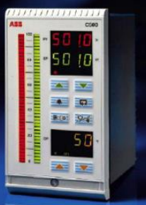.

Figura 6. PID Comercial 1

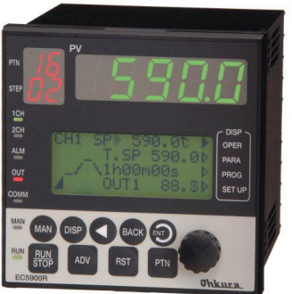.

Figura 7. PID Comercial 2

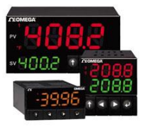.

Figura 8. PID Comercial 3

Los PID de las imagenes nos muestran como a pesar de funcionar con los mismos principios estos PID funcionan de una mejor manera, y por ende el precio de uno con respecto al otro puede llegar a ser muy elevado.

Aparte de eso los PID tambien se pueden manejar en algunos programas de simulacion de circuitos, como en los PLC´s de siemens, o en Logosoft, incluso se puede usar en programa como Matlab, el cual nos permite hacer funcionar controladores PID en la industria. 

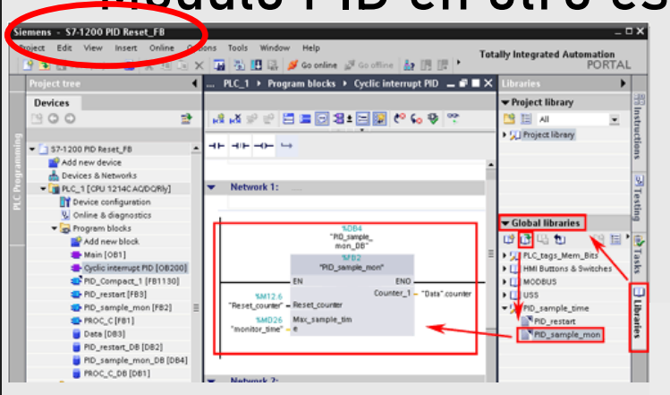.

Figura 9. PID Siemens

## 6. Criterio de desempeño 

### 6.1. Funciones de costo mas utilizadas

Son las que ayudan a saber que tan bien sintonizado esta el error, estos me permiten saber que cambios hace el controlador. Estas son las pruebas mas comunes.

- IE = Integral del error = Se integra para saber que tan bueno él es controlador = $\int e(t)dt$
- ISE = Integral del error al cuadrado = Se utiliza para solo tener valores positivos = $\int e(t)^{2}dt$
- IAE = Integral del error absoluto = Se utiliza cuando hay valore muy pequeños que al elevarlos al cuadrado tienden a cero  = $\int |e(t)|dt$
- ITAE = Integral del error absoluto por el tiempo = Es para cuando el error no disminuye rápidamente. = $\int |e(t) * t|dt$

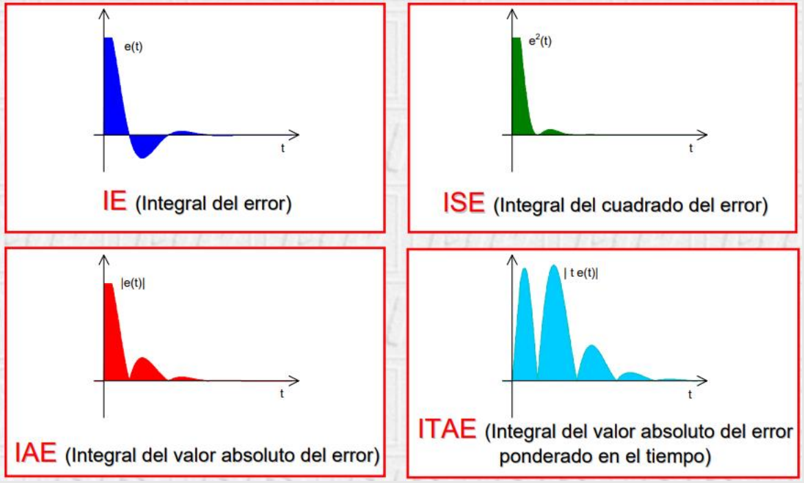.

Figura 10. Graficas integrales del error.

### 6.2. Criterio de sintonización por optimización 

Estas metodologías buscan minimizar algunos índices de desempeño, utilizando los métodos vistos anteriormente. Esto con variaciones en los parámetros para obtener una función de costo que nos permita encontrar un óptimo ideal. 

$$L(t) = f(\int e(t), t)$$

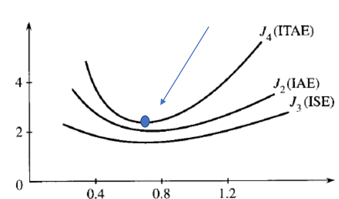.

Figura 11. Grafica optimo

## 7. Métodos de sincronización

### 7.1. Método de Ziegler & Nichols

Este es el primer metodo que se vio en clase, para la sintonizacion de controladores PID en lazo abierto. Este metodo utiliza parametros de primer orden mas tiempo muerto que se obtienen en las curvas de reaccion.
Este metodo nos garantiza que la segunda oscilacion de la respuesta sea 1/4 del maximo pico. 

|Tipo de controlador   | $k_{p}$  | $T_{i}$  | $T_{d}$  |
|---|---|---|---|
| P  | $\frac{\tau}{t_{o}K}$  | ---  | ---  |
| PI  | $\frac{0.9\tau}{t_{o}K}$  | $3.3t_{o}$  | ---  |
| PID  | $\frac{0.9\tau}{t_{o}K}$   | $2t_{o}$  | $0.5t_{o}$  |

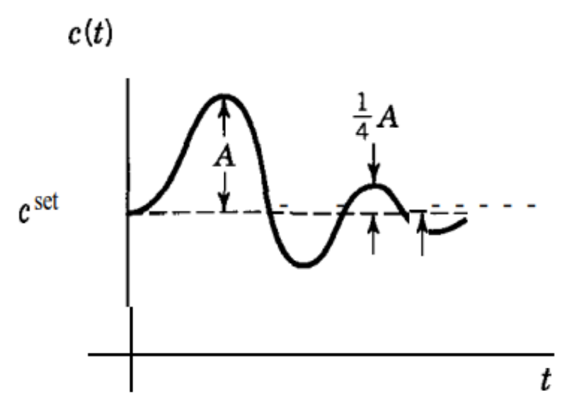.

Figura 12. Caida de la respuesta ante perturbaciones

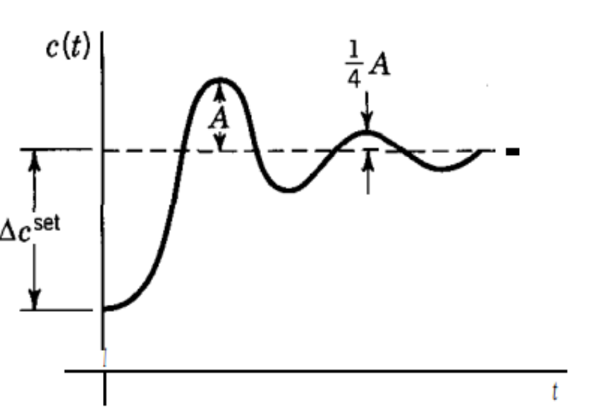.

Figura 13. Caida de la respuesta ante cambios en la referencia

Podemos observar en las imágenes que ante distintas circunstancias, cuando aplicamos el método de Ziegler y Nichols la curva de reacción será la esperada, en donde su segunda oscilación será un cuarto de la primera.

### 7.2. Método de Cohen-coon

El segundo método de sintonización en PID de lazo abierto que se explicó en la clase es el de cohen-Coon, el cual tiene algunas similitudes con el de Ziegler y Nichols en cuando a las ganancias integral y derivativas en el PID.

Por lo tanto, al igual que en el método anterior la segunda oscilación también será de un cuarto de la primera, y además tendremos un sobre impulso y área bajo la curva muy reducidas

| Tipo de controlador  | $k_{p}$  | $T_{i}$  | $T_{d}$  |
|---|---|---|---|
| P   | $\frac{1}{K} * \frac{\tau }{t_{o}} * (\frac{3\tau + t_{o}}{3\tau})$  | ---  | ---  |
| PI   | $\frac{1}{K} * \frac{\tau }{t_{o}} * (\frac{10.8\tau + t_{o}}{12\tau})$  | $(\frac{30 + 3(\frac{t_{0}}{\tau })}{9 + 20(\frac{t}{\tau })}) * \tau $  | ---  |
| PID   | $\frac{1}{K} * \frac{\tau }{t_{o}} * (\frac{16\tau + 3t_{o}}{12\tau})$  | $2t_{o}$  | $0.5t_{o}$  |

### 7.3. Método de coeficiente de ajustabilidad

El método de coeficiente de ajustabilidad ya tiene varias diferencias con respecto a los métodos mencionados anteriormente. La primera diferencia está en que para escoger las ganancias que se usaran para el PID dependerá de cuanto será la variable "y" la cual está determinada por el tiempo muerto sobre el Tao. 

$y = \frac{t_{m}}{\tau }$

Después de hacer esa operación y obtener "y" usaremos los intervalos que se muestran en la siguiente tabla para saber los valores de nuestras ganancias.

 
| y  | $k_{p}$  | $T_{i}$  | $T_{d}$  |
|---|---|---|---|
| 0 a 0.1  | $\frac{5}{K}$  | $\tau$  | ---  |
| 0.1 a 0.2  | $\frac{0.5}{K_{y}}$  | $\tau$  | ---  |
| 0.2 a 0.5  | $\frac{0.5(1 + 0.5_{y})}{K_{y}}$  | $\tau(1 + 0.5_{y})$  | $\tau * \frac{0.5_{y}}{0.5_{y} + 1}$  |

### 7.4. Método Smith (PID)

El método de Smith es el último que se presentó en la clase y este se basa en dos tablas, una nos da valores de unas constantes que nos ayudaran a encontrar cuanto son los valores de las ganancias en un PI. Mientras que el otro nos da también unos valores para las constantes, pero esta nos ayudara a encontrar las ganancias de un PID, como se muestra en las siguientes figuras:

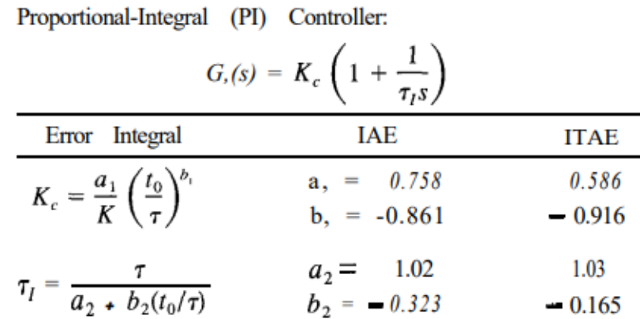.

Figura 14.Metodo Smith PI

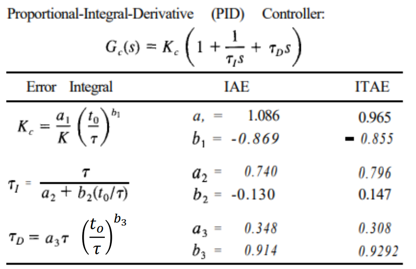.

Figura 15.Metodo Smith PID

## 8. Ejercicios 

📚 Ejercicio 1

En el primer ejercicio se requiere hallar la función de transferencia de un sistema lazo abierto por el método de Ziegler & Nichols, en base a los siguientes datos: 
- k = 2
- $t_{m} = 3 segundos$
- $\tau = 7 segundos$

Lo primero que haremos será modelar la curva de reacción de un sistema en lazo abierto.

$$u(t) = K * (1 - e^-{t - t_{m}}/\tau) * u(t - t_{m})  $$

Lo siguiente que hacemos es aplicar la tabla de Ziegler & Nichols, para despejar nuestras ganancias. La primera que se calcula es la ganancia proporcional y los tiempos en el integral y en el derivativo 

$$K_{p} = 1.2 * \frac{\tau }{t_{m}}$$
$$K_{p} = 1.2 * \frac{7}{3}$$
$$K_{p} = 2.8$$

$$T_{i} = 2 * t_{m}$$
$$T_{i} = 2 * 3$$
$$T_{i} = 6$$

$$T_{d} = 0.5t_{m}$$
$$T_{d} = 0.5 * 3$$
$$T_{d} = 1.5$$ 

Ya con eso podemos calcular las ganancias en cada una de las partes del PID

$$K_{p} = 2.8$$

$$K_{i} = \frac{K_{p}}{T_{i}}$$
$$K_{i} = \frac{2.8}{6}$$
$$K_{i} = 0.467$$

$$K_{d} = K_{p} * T_{d}$$
$$K_{d} = 2.8 * 1.5$$
$$K_{d} = 4.2$$

Ya con todas las ganancias podemos poner la función de transferencia

$$G(s) = K_{p} + \frac{K_{i}}{s} + K_{d} * s $$
$$G(s) = 2.8 + \frac{0.467}{s} + 4.2 * s$$ 

📚 Ejercicio 2
Para el segundo ejercicio se tiene   la siguiente función de transferencia $G(s) = \frac{3e^{-2s}}{8s + 1}$ a la que debemos diseñar un controlador PID en lazo abierto por el método de coeficiente de ajustabilidad. Para eso tenemos los siguientes datos:

K = 3
$t_{m} = 2$
$\tau = 8$

El primer paso cuando usamos este método es hallar nuestra variable "y" la cual se encuentra dividiendo mi tiempo muerto entre Tao.

$$y = \frac{t_{m}}{\tau } = \frac{2}{8}$$
y = 0.25

Ya con eso tenemos el intervalo de la tabla que nos sirve para encontrar las ganancias del sistema. La primera que se encuentra es la ganancia proporcional que se resuelve de la siguiente manera:

$$K_{p} = \frac{1}{K} * (\frac{1.35}{y} + 0.25)$$
$$K_{p} = \frac{1}{3} * (\frac{1.35}{0.25} + 0.25)$$
$$K_{p} = 1.88$$

Después proseguimos con la ganancia integral, a la que le aplicamos la fórmulas de la tabla y reemplazamos.

$$T_{i} = \tau * \frac{y + 0.1}{y + 0.5}$$
$$T_{i} = 8 * \frac{0.25 + 0.1}{0.25 + 0.5}$$
$$T_{i} = 3.74$$

Por último hallamos la ganancia derivativa, que al igual que en las anteriores es usar la formula y despejar.

$$T_{d} = \tau  * \frac{0.5y}{y + 0.1}$$
$$T_{d} = 8 * \frac{0.5 * 0.25}{0.25 + 0.1}$$
$$T_{d} = 2.86$$

Una vez tenemos nuestras ganancias podemos poner la función de transferencia con el coeficiente de ajustabilidad, el cual es el siguiente:

$$Gp(s) = 1.88 (1 + \frac{1}{3.74s} + 2.86s)$$

## 9. Conclusión

La sincronización de un controlador PID en lazo abierto es una técnica fundamental dentro del diseño de sistemas de control, especialmente útil en aplicaciones donde no se dispone de retroalimentación directa o esta no es práctica durante la etapa de sintonización inicial. A través del análisis de las acciones proporcional, integral y derivativa, comprendemos cómo cada una de ellas contribuye de manera distinta al comportamiento del sistema, afectando parámetros como el tiempo de respuesta, el error estacionario, la estabilidad y las oscilaciones.

Los distintos tipos de arquitecturas PID **paralela**, **ideal** y **serie** ofrecen alternativas de implementación según las características y complejidad del proceso a controlar. De igual manera, los métodos de sintonización presentados, como los de **Ziegler-Nichols**, **Cohen-Coon**, **coeficiente de ajustabilidad** y **Smith**, proporcionan guías sistemáticas para ajustar las constantes del controlador y así lograr un desempeño adecuado, buscando un equilibrio entre rapidez de respuesta, precisión y estabilidad.

En definitiva, la sincronización de PID en lazo abierto, aunque presenta limitaciones al no considerar la retroalimentación del sistema durante el ajuste, resulta ser una herramienta efectiva para el diseño preliminar de controladores. El éxito de esta técnica radica en la correcta selección del método de sintonización y en el análisis detallado del proceso, permitiendo así un punto de partida sólido para un ajuste fino posterior bajo lazo cerrado si es necesario.

## 10. Referencias

- Ajuste empírico controladores PID. F Morilla. Dpto. Informatica y Automática, UNED, 2006
- Handbook of PI and PID controller Tuning Rules, Aidan O’Dwyer, 3d edition, 2009
- Analog & Digital Control Systems Design. Chi Tsong Chen. State University of New York. New York
- Principles and practice of automatic process control. Smith. C. and A. Corripio. 2 Edition. Jhon Wiley & Sons Editorial
