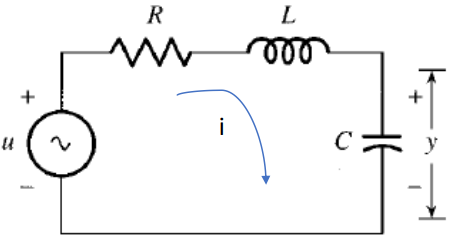
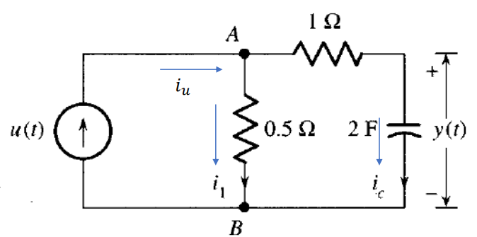
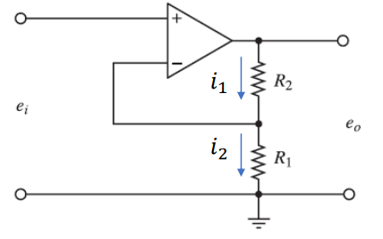

# Sistemas electricos

## 1. Circuitos RLC 

### 1.1. Introduccion 

El modelamiento de sistemas electricos es muy importante cuando tenemos que predecir la dinamica de un circuito RLC, mediante representaciones matematicas. Estos circuitos estan compuestos por Resistencias (R), capacitores (C) e inductancias  (L), las cuales se resuelven con la ley de ohm, y las leyes de Kirchhoff (mallas y nodos). Estas se resuelven mediante ecuaciones diferenciales, las cuales estan relacionadas con la corriente y tension en el dominio del tiempo    

### 1.2. Definicion

Los circuitos RLC son sistemas que estan compuestos por Resistencias, Capacitores e inductancias, del cual podemos determinar como funciona su modelo dinamico dependiendo de su señal de entrada, y su configuracion (Serie, Paralelo, Mixto). Para poder modelar los circuitos aplicamos la ley de ohm o las leyes de kirchoff. Para poder hacer esto tenemos que tener presentes las ecuaciones de la ley de ohm, de carga de un condensador y carga de un inductor.

  - Ley de ohm
    
$R=\frac{v(t)}{i(t)}$

  - Carga de un condesador

 $i(t)= C\frac{dv(t)}{dt}$

   - Carga de un inductor

$v(t)= L\frac{di(t)}{dt}$ 

### 1.3. Ejemplos circuitos RLC
#### 1.3.1 Primer ejemplo

.

Figura 1. Ejemplo1

En este primer ejemplo tenemos un circuito en serie, y necesitamos modelarlo para que quede en terminos del voltaje que pasa por nuestro condensador [y(t)]

Lo primero que hacemos es aplicar la ley de kirchoff de mallas, en donde todos los voltajes de la malla son iguales a cero

$-u + v_{R} + v_{L} + v_{C} = 0$

Luego tomamos los voltajes y los remplazamos con las variables que conocemos.

$-u(t) + i(t) * R + l\frac{di(t)}{dt} + y(t) = 0$

Despues hacemos que todo quede con los mismo terminos, que serian los del condesador [y(t)]. Aplicando la formula de carga del condesador podemos dejar en terminos de y(t) la inductancia del circuito.

$i(t) = C\frac{dy(t)}{dt}$

$-u(t) + R*C\frac{dy(t)}{dt} + (L\frac{d}{dt})(C\frac{dy(t)}{dt}) + y(t) = 0$

Por ultimo multiplicamos los terminos reemplazados anteriormente y organizamos la ecuacion para dejarla modelada.

$-u(t) + R*C\frac{dy(t)}{dt} + LC\frac{d^{2}y(t)}{dt^{2}} + y(t) = 0$

#### 1.3.2. Segundo ejemplo

.

Figura 2. Ejemplo 2

Para el segundo ejemplo tambien buscaremos el voltaje que pasa por y(t).

Lo primero que haremos es aplicar la ley de kirshoff de nodos, donde tomamos todas las corrientes del circuito y las iguales a cero.

$i_{u} - i_{1} - i_{c} = 0$

Luego reemplazamos en la formula las corrientes con los valores que vemos en la imagen.

$i_{u}(t) - \frac{V_{AB}}{0.5} - 2\frac{dy(t)}{dt} = 0$

Despues determinamos a cuanto equivale $V_{AB}$, el cual es igual al voltaje que pasa por la resistencia mas el voltaje del condensador. Sabiendo que el voltaje de la resistencia es el valor de la misma por la corriente que pasa $(i_{c})$; y el voltaje que pasa por el condensador es y(t).
Sabiendo que $i_{c} = 2\frac{dy(t)}{dt}$ lo reemplazamos en la ecuacion para que todo nos quede en terminos de y(t)

$V_{AB} = i_{c}*1 + y(t)$

$V_{AB} = 2\frac{dy(t)}{dt} + y(t)$

Lo siguiente que se hace es reemplazar $V_{AB}$ en la ecuacion principal.

$u(t) - \frac{2dy(t)}{0.5dt} - y(t)\frac{1}{0.5} - 2\frac{dy(t)}{dt} = 0$

Por ultimo se despeja la ecuacion y se organiza para que se pueda entender como es el modelo 

$u(t) - 6\frac{dy(t)}{dt} - 2y(t) = 0$

### 1.4. Ejercicio 

## 2. Circuitos con amplificadores operacionales 

### 2.1. Introduccion 
Un amplificador es un dispositivo electronico que sirve para aumentar la amplitud de una señal electrica sin cambiar en gran medida sus caracteristicas principales. Los que tienden a ser mas usados son los amplificadores operacionales, esto debido a que tienen una buena estabilidad y versatilidad; ademas son muy utiles para procesar señales. Para utilizar los amplificadores operacionales tenemos varios tipos de configuraciones que pueden ser utilizadas, las que usaremos en el curso son el amplificador inversor y el no inversor; cada uno se puede usar para diferentes tareas, y dependiendo de la señal que necesitemos podremos usar uno u otro.

### 2.2 Amplificador no inversor
El amplificador no inversor es una connfiguracion del amplificador operacional, donde la señal de entrada se aplica a la entrada no inversora (La parte positiva del operacional +) y la terminal inversora se conecta a una red de realimentacion resistiva, donde se regula la ganacia del amplificador. Algunas de las caracteristicas de esta configuracion son que tension entre las dos entradas del amplificador son iguales (V+ = V-); y que las corrientes que pasan por las entradas es igual a cero. Para poder modelarlo utilizaremos las leyes de kirchoff, y el modelo simplificado de los amplificadores operacionales.

### 2.3 Ejemplo 

.

Figura 1. Ejemplo amplificadores 

Como ejemplo utilizaremos el de la imagen, en donde observamos que el circuito tiene dos resistencias, donde nuestra variables de interes sera $e_{o}$. la primer resistencia va entre la salida del amplificador y la entrada del terminal negativo, y la segunda va desde la salida, hasta tierra. 
Lo primero que hacemos es usar la ley de nodos, la cual nos dice que la suma de las corrientes que pasan por las resistencias es igual a cero

$i_{1} - i_{2} = 0$

Luego reemplazamos las corrientes para dejarlo todo en termino del voltaje utilizando la ley de ohm, como la primer resistencia esta siendo afectada por los voltajes de entrada y salida el valor la corriente en ese punto sera la diferencia entre los voltajes de entrada y salida sobre el valor de la resistencia; y como la segunda resistencia esta entre la salida y tierra el valor de la corriente sera el voltaje de salida sobre la corriente

$\frac{e_{o}-e_{i}}{R_{2}} - \frac{e_{i}}{R_{1}} = 0$

Por ultimo lo que hacemos es separar variables y despejar la ecuacion para que nos quede el modelo de la salida del amplificador $(e_{o})$

$\frac{e_{o}}{R_{2}} = e_{i}(\frac{1}{R_{2}} + \frac{1}{R_{1}})$

$e_{o} = e_{i}(1 + \frac{R_{2}}{R_{1}})$

### 2.4 Ejercicio 

## 3. Conclusiones
Agregue unas breves conclusiones sobre los temas trabajados en cada clase, puede ser a modo de resumen de lo trabajado o a indicando lo aprendido en cada clase

## 4. Definiciones
Utilice el símbolo '>' para crear bloques de texto. En la presente plantilla estas cajas están reservadas para resaltar las definiciones, las cuales deben ser breves, y la palabra o frase que se está definiendo debe estar en letra itálica. El inicio del bloque de texto debe realizarse con el emoji 🔑 .
>🔑 *Definición:* descripción precisa y clara del significado de una palabra, término, concepto o fenómeno. Es una explicación que establece los límites y el alcance de aquello que se está definiendo, aclarando su naturaleza, características esenciales y, en algunos casos, su relación con otros conceptos.

## 9. Ejercicios
Deben agregar 2 ejercicios con su respectiva solución, referentes a los temas tratados en cada una de las clases. Para agregar estos, utilice la etiqueta #, es decir como un nuevo título dentro de la clase con la palabra 'Ejercicios'. Cada uno de los ejercicios debe estar numerado y con su respectiva solución inmediatamente despues del enunciado. Antes del subtitulo de cada ejercicio incluya el emoji 📚

## 5. Referencias

