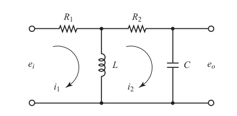
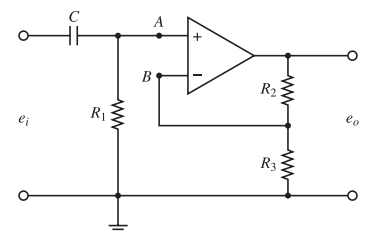

# Sistemas electricos

## 1. Circuitos RLC 

### 1.1. Introduccion 

El modelamiento de sistemas electricos es muy importante cuando tenemos que predecir la dinamica de un circuito RLC, mediante representaciones matematicas. Estos circuitos estan compuestos por Resistencias (R), capacitores (C) e inductancias  (L), las cuales se resuelven con la ley de ohm, y las leyes de Kirchhoff (mallas y nodos). Estas se resuelven mediante ecuaciones diferenciales, las cuales estan relacionadas con la corriente y tension en el dominio del tiempo    

>🔑 Ley de ohm: Es la resistencia de un conductor que teniendo aplicada entre sus extremos una diferencia de potencial de un voltio está recorrido por una corriente de un amperio.
>🔑 Ley de kirchoff: Las leyes de Kirchhoff son dos igualdades que describen el comportamiento de la corriente y el voltaje en los circuitos eléctricos. Se basan en la conservación de la energía y la carga

### 1.2. Descripción

Los circuitos RLC son sistemas que estan compuestos por Resistencias, Capacitores e inductancias, del cual podemos determinar como funciona su modelo dinamico dependiendo de su señal de entrada, y su configuracion (Serie, Paralelo, Mixto). Para poder modelar los circuitos aplicamos la ley de ohm o las leyes de kirchoff. Para poder hacer esto tenemos que tener presentes las ecuaciones de la ley de ohm, de carga de un condensador y carga de un inductor.

  - Ley de ohm
    
$R=\frac{v(t)}{i(t)}$

  - Carga de un condesador

 $i(t)= C\frac{dv(t)}{dt}$

   - Carga de un inductor

$v(t)= L\frac{di(t)}{dt}$ 

>🔑Inductor: Un inductor, bobina o reactor es un componente pasivo de un circuito eléctrico que almacena energía en forma de campo magnético.​
>🔑Capacitor: Un capacitor, también conocido como condensador, es un dispositivo que almacena y libera energía eléctrica

### 1.3. Ejemplos circuitos RLC
#### 💡 1.3.1 Primer ejemplo

.

Figura 1. Ejemplo1

En este primer ejemplo tenemos un circuito en serie, y necesitamos modelarlo para que quede en terminos del voltaje que pasa por nuestro condensador [y(t)]

Lo primero que hacemos es aplicar la ley de kirchoff de mallas, en donde todos los voltajes de la malla son iguales a cero

$$-u + v_{R} + v_{L} + v_{C} = 0$$

Luego tomamos los voltajes y los remplazamos con las variables que conocemos.

$$-u(t) + i(t) * R + l\frac{di(t)}{dt} + y(t) = 0$$

Despues hacemos que todo quede con los mismo terminos, que serian los del condesador [y(t)]. Aplicando la formula de carga del condesador podemos dejar en terminos de y(t) la inductancia del circuito.

$$i(t) = C\frac{dy(t)}{dt}$$

$$-u(t) + R*C\frac{dy(t)}{dt} + (L\frac{d}{dt})(C\frac{dy(t)}{dt}) + y(t) = 0$$

Por ultimo multiplicamos los terminos reemplazados anteriormente y organizamos la ecuacion para dejarla modelada.

$$-u(t) + R*C\frac{dy(t)}{dt} + LC\frac{d^{2}y(t)}{dt^{2}} + y(t) = 0$$

#### 💡 1.3.2. Segundo ejemplo

.

Figura 2. Ejemplo 2

Para el segundo ejemplo tambien buscaremos el voltaje que pasa por y(t).

Lo primero que haremos es aplicar la ley de kirshoff de nodos, donde tomamos todas las corrientes del circuito y las iguales a cero.

$$i_{u} - i_{1} - i_{c} = 0$$

Luego reemplazamos en la formula las corrientes con los valores que vemos en la imagen.

$$i_{u}(t) - \frac{V_{AB}}{0.5} - 2\frac{dy(t)}{dt} = 0$$

Despues determinamos a cuanto equivale $V_{AB}$, el cual es igual al voltaje que pasa por la resistencia mas el voltaje del condensador. Sabiendo que el voltaje de la resistencia es el valor de la misma por la corriente que pasa $(i_{c})$; y el voltaje que pasa por el condensador es y(t).
Sabiendo que $i_{c} = 2\frac{dy(t)}{dt}$ lo reemplazamos en la ecuacion para que todo nos quede en terminos de y(t)

$$V_{AB} = i_{c}*1 + y(t)$$

$$V_{AB} = 2\frac{dy(t)}{dt} + y(t)$$

Lo siguiente que se hace es reemplazar $V_{AB}$ en la ecuacion principal.

$$u(t) - \frac{2dy(t)}{0.5dt} - y(t)\frac{1}{0.5} - 2\frac{dy(t)}{dt} = 0$$

Por ultimo se despeja la ecuacion y se organiza para que se pueda entender como es el modelo 

$$u(t) - 6\frac{dy(t)}{dt} - 2y(t) = 0$$

### 📚 1.4. Ejercicio 

.

Figura 3, Ejercicio 1

Lo primero que se hizo para resolver este problema, fue decidir que se iba a resolver el problema con la ley de kirchhoff de mallas, en donde nos saldran dos ecuaciones (Una por cada malla).

$$e_{i} =R _{1}i_{1} + v_{L}$$

$$v_{L} = R_{2}i_{2} + e_{o}$$

En la ecuacion de la segunda malla dejamos todo en terminos de la corriente, y derivamos.

$$L\frac{di_{2}}{dt} = R_{2}i_{2} + e_{o}$$
$$L\frac{d^{2}i_{2}}{dt^{2}} = R_{2}\frac{i_{2}}{dt} + \frac{de_{o}}{dt}$$

Calculamos la ecuacion del capacitor sabiendo que $i_c = i_1 - i_2$

$$C\frac{de_{o}}{dt} = i_{1} - i_{2}$$

En la primera malla dejamos la inductacia en terminos de corriente y despejamos la ecuacion. 

$$i_{1} = \frac{e_{i} - L\frac{di_{2}}{dt}}{R_{1}}$$

Despues sustituimos la corriente uno, con la ecuacion del capacitor, y multiplicamos nuestro resultado por R1 para despejar los que nos queda en el denominador

$$C\frac{de_{o}}{dt} = \frac{e_{i}-L\frac{di_{2}}{dt}}{R_{1}} - i_{2}$$

$$R_{1}C\frac{de_{o}}{dt} = e_{i}-L\frac{di_{2}}{dt} - R_{1}i_{2}$$

Despues sustituimos la ecuacion de la bobina, y agrupamos terminos.

$$R_{1}C\frac{de_{o}}{dt} = e_{i} - (R_{2}\frac{di_{2}}{dt} + frac{de_{0}}{dt}) - R_{1}i_{2}$$

$$R_{1}C\frac{de_{o}}{dt} + \frac{de_{o}}{dt} + R_{2}\frac{di_{2}}{dt} +  R_{1}i_{2} = e_{i}$$

Sustituimos $i_2$ para agrupar los terminos del la ecuacion modelada.

$$L\frac{d^{2}i_{2}}{dt^{2}} = R_{2}\frac{di_{2}}{dt} + \frac{de_{o}}{dt}$$

$$R_{1}C\frac{de_{o}}{dt} + \frac{de_{o}}{dt} + R_{2}(\frac{Ld^{2}e_{o}}{R_{2}dt^{2}} - \frac{de_{o}}{R_{2}dt}) + R_{1}(\frac{Ld^{2}e_{o}}{R_{2}dt^{2}} - \frac{de_{o}}{R_{2}dt}) = e_{i}$$

Por ultimo agrupamos terminos, y organizamos la ecuacion 

$$LC\frac{d^{2}e_{o}}{dt^{2}} + (R_{1}C + \frac{L}{R_{2}})\frac{de_{o}}{dt} + e_{o}(\frac{R_{1}}{R_{2}} + 1) = e_{i}$$

## 2. Circuitos con amplificadores operacionales 

### 2.1. Introduccion 
Un amplificador es un dispositivo electronico que sirve para aumentar la amplitud de una señal electrica sin cambiar en gran medida sus caracteristicas principales. Los que tienden a ser mas usados son los amplificadores operacionales, esto debido a que tienen una buena estabilidad y versatilidad; ademas son muy utiles para procesar señales. Para utilizar los amplificadores operacionales tenemos varios tipos de configuraciones que pueden ser utilizadas, las que usaremos en el curso son el amplificador inversor y el no inversor; cada uno se puede usar para diferentes tareas, y dependiendo de la señal que necesitemos podremos usar uno u otro.

### 2.2 Amplificador no inversor
El amplificador no inversor es una connfiguracion del amplificador operacional, donde la señal de entrada se aplica a la entrada no inversora (La parte positiva del operacional +) y la terminal inversora se conecta a una red de realimentacion resistiva, donde se regula la ganacia del amplificador. Algunas de las caracteristicas de esta configuracion son que tension entre las dos entradas del amplificador son iguales (V+ = V-); y que las corrientes que pasan por las entradas es igual a cero. Para poder modelarlo utilizaremos las leyes de kirchoff, y el modelo simplificado de los amplificadores operacionales.

### 💡 2.3 Ejemplo 

.

Figura 4. Ejemplo amplificadores 

Como ejemplo utilizaremos el de la imagen, en donde observamos que el circuito tiene dos resistencias, donde nuestra variables de interes sera $e_{o}$. la primer resistencia va entre la salida del amplificador y la entrada del terminal negativo, y la segunda va desde la salida, hasta tierra. 
Lo primero que hacemos es usar la ley de nodos, la cual nos dice que la suma de las corrientes que pasan por las resistencias es igual a cero

$$i_{1} - i_{2} = 0$$

Luego reemplazamos las corrientes para dejarlo todo en termino del voltaje utilizando la ley de ohm, como la primer resistencia esta siendo afectada por los voltajes de entrada y salida el valor la corriente en ese punto sera la diferencia entre los voltajes de entrada y salida sobre el valor de la resistencia; y como la segunda resistencia esta entre la salida y tierra el valor de la corriente sera el voltaje de salida sobre la corriente

$$\frac{e_{o}-e_{i}}{R_{2}} - \frac{e_{i}}{R_{1}} = 0$$

Por ultimo lo que hacemos es separar variables y despejar la ecuacion para que nos quede el modelo de la salida del amplificador $(e_{o})$

$$\frac{e_{o}}{R_{2}} = e_{i}(\frac{1}{R_{2}} + \frac{1}{R_{1}})$$

$$e_{o} = e_{i}(1 + \frac{R_{2}}{R_{1}})$$

### 📚 2.4 Ejercicio 

.

Figura 5, ejercicio 2

En este ejercicio trabajaremos por nodos, en donde la corriente que entra al terminal positivo estara en el nodo A, que sera la suma de la corriente del capacitor por la corriente de la resistencia, la cual es igual a cero.

$$i_C + i_{R1} = 0$$

Despues usamos las ecuacion de carga de un capacitor y de ohm para dejar todo en terminos de voltaje. Y multiplicamos por $R_1$ para que no nos quede nada en el denominador.

$$i_C = C \frac{d(e_i - v_A)}{dt}$$

$$i_{R_1} = \frac{v_A}{R_1}$$

$$C \frac{d(e_i - v_A)}{dt} + \frac{v_A}{R_1} = 0$$

$$C \frac{de_i}{dt} - C \frac{dv_A}{dt} + \frac{v_A}{R_1} = 0$$

$$R_1 C \frac{de_i}{dt} - R_1 C \frac{dv_A}{dt} + v_A = 0$$

Como el alimentador tiene alimentacion negativa se asume que el voltaje en ambos nodos es el mismo, y aplicamos ley de kirchhoff

$$\frac{v_B - e_o}{R_2} + \frac{v_B}{R_3} = 0$$

Despues sutituimos $v_B$ por $v_A$, y multiplicamos por $R_2 Y R_3$ para no manejar denominadores

$$\frac{v_A - e_o}{R_2} + \frac{v_A}{R_3} = 0$$

$$R_3 (v_A - e_o) + R_2 v_A = 0$$

$$R_3 (v_A - e_o) + R_2 v_A = 0$$

Para despues factorizar $v_A$ y despejarla posteriormente

$$(R_3 + R_2) v_A = R_3 e_o$$

$$v_A = \frac{R_3}{R_3 + R_2} e_o$$

Despues sustituimos $v_A$ en el nodo A.

$$R_1 C \frac{de_i}{dt} - R_1 C \frac{d}{dt} \left( \frac{R_3}{R_3 + R_2} e_o \right) + \frac{R_3}{R_3 + R_2} e_o = 0$$

$$R_1 C \frac{de_i}{dt} - R_1 C \frac{R_3}{R_3 + R_2} \frac{de_o}{dt} + \frac{R_3}{R_3 + R_2} e_o = 0$$

Por ultimo despejamos la ecuacion.

$$\frac{de_i}{dt} = \frac{R_3}{(R_3 + R_2) R_1} \frac{de_o}{dt} - \frac{R_3}{(R_3 + R_2) R_1 C} e_o$$

 

## 3. Conclusion

Para poder trabajar bien los modelamientos de circuitos electricos, es fundamental entender como funcionan las leyes de kirchhoff, tanto para malla o nodos, ya que dependiendo de la aplicacion que necesitemos nos convendra usar mas uno que otro, y dependiendo de lo que deseamos encontrar mas los componentes que nos pida el ejercicio sera mas util resolverlo en base a la suma de corrientes, o voltajes.

## 5. Referencias

- C. Chen, Analog and digital control system design, New York, Saunders College Publishing
- Introducción a los sistemas de control, R. Hernandez, Pearson, 2010
- Ogata, K. Ingeniería de Control Moderna. 5 edición. Prentice Hall
