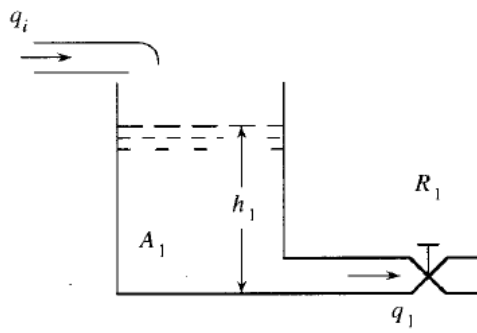
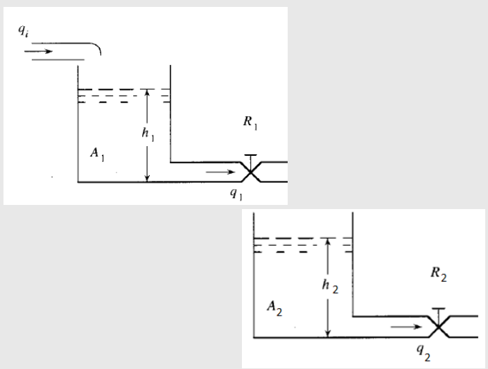
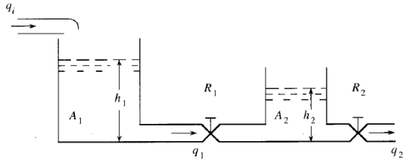

# Sistemas hidraulicos y termicos

## 1 Sistemas hidraulicos 
### 1.1 Introduccion

Los sistemas hidraulicos operan una tecnolofia que utiliza los liquidos para generar movimiento o fuerza. Se rige con el principio de la ley de Pascal, la cual dice que la presion que se aplica sobre un fluido confinado se transmite uniformemente en todas las direcciones. Gracias a eso lo sistemas pueden incrementar la fuerza y manejar un control mas preciso de las maquinas.

### 1.2 Sistema

.

Figura 1, Tanque de agua

Este sistema funciona mediante el principio de Pascal, en el cual es fundamental que mantengan un nivel de flujo constante, en donde segun la figura 1 podemos decir que:
  - $q_{i}, q_{o}$; son los flujos de entrada y salida del liquido 
  - R, Es la resistencia al flujo
  - A, Area transversal del tanque
  - h, Nivel de liquido en el tanque  

### 1.3 Modelamiento tanques

La ecuacion que indica el flujo de salida del tanque (figura 1) es:

 - $q_{1} = \frac{h_{1}}{R_{1}}$

Para el intercambio de masa usasmos lo siguiente:

 - $A_{1}\frac{dh_{1}}{dt} = q_{i} - q_{1}$

Mostramos como queda el modelo del tanque teniendo $q_{i}$ como entrada y $h_{1}$ como altura. Primero determinamos las ecuaciones vistas anteriormente, y despues unimos las dos ecuaciones reemplazando $q_{1}$ en ambas para que nos quede en terminos de $q_{i}$ 

- $q_{1} = \frac{d_{1}}{R1}$
- $A_{1}\frac{dh_{1}}{dt} = q_{i} - q_{1}$
- $A_{1}\frac{dh_{1}}{dt} = q_{i} - \frac{h_{1}}{R_{1}}$

En este caso se modela conociendola entrada del sistema $(q_{i})$ la salida $q_{1}$. En este caso lo que hacemos es que en base a las ecuaciones que conocemos despejamos la altura, y al igual que en el otro modelamiento unimos las ecuaciones para tener un modelo en base a la entrada por la salida del sistema.

- $q_{1} = \frac{h_{1}}{R1}$
- $A_{1}\frac{dh_{1}}{dt} = q_{i} - q_{1}$
- $h_{1} = q_{1}*R1$
- $R1A_{1}\frac{dh_{1}}{dt} = q_{i} - q_{1}$ 
 
#### 1.3.1 💡 Ejemplo con dos tanques

.

Figura 2, dos tanques

En caso de trabajar con dos tanques, para modelarlo lo primero que hacemos es definir en base a que variables vamos a trabajar, en este caso lo hicimos con relacion a la entrada del primer tanque $q_{i}$ y las alturas de los tanques, esto debido a que podemos relacionar los dos sistemas con $q_{1}$, la cual es la salida del primer tanque y la entrada del segundo. Usando las formalas despejamos $q_{i}$.

$$q_{i} = A_{1}\frac{dh_{1}}{dt} + q_{1}$$

$$q_{i} = A_{1}\frac{dh_{1}}{dt} + \frac{h_{1}}{R_{1}}$$

$$\frac{h_{1}}{R_{1}} = q_{i} - A_{1}\frac{dh_{1}}{dt}$$

Como sabemos que $q_{1} = \frac{h_{1}}{R_{1}}$ entonces reemplazamos esos datos en la segunda ecuacion y despejamos.

$$\frac{h_{1}}{R_{1}} - q_{2} = A_{2}\frac{dh_{2}}{dt}$$

$$\frac{h_{1}}{R_{1}} = A_{2}\frac{dh_{2}}{dt} + q_{2}$$

Por ultimo ya que despejamos las ecuaciones lo que hacemos es unir la ecuacion de cada tanque para que quede el modelo de ambos.

$$q_{i} - A_{}\frac{dh_{1}}{dt} = A_{2}\frac{dh_{2}}{dt} + q_{2}$$

#### 1.3.2 💡 Ejemplo tanques interconectados

.

Figura 3, Tanques interconectados

En el caso de los tanques interconectados lo primero que se hace es plantear las ecuacion inciales de cada uno. Son casi iguales a las que se muestran al inicio del tema, solo que en el caso del primer tanque el caudal se ve afectado por la diferencia de altura que hay entre ambos tanques.

$$q_{1} = \frac{h_{1} - h_{2}}{R_{1}}$$

$$A_{1}\frac{dh_{1}}{dt} = (q_{i} - q_{1})$$

$$q_{2} = \frac{h_{2}}{R_{2}}$$

$$A_{2}\frac{dh_{2}}{dt} = (q_{1} - q_{2})$$

Al igual que en el ejemplo anterior la variable que relaciona ambos tanques es $q_{1}$ por lo tanto lo primero que haremos es despejarla para poder relacionar los dos tanques despues

$$R_{2}A_{2}\frac{dq_{2}}{dt} = (q_{1} - q_{2})$$

$$R_{2}A_{2}\frac{dq_{2}}{dt} + q_{2} = q_{1}$$

Luego reemplazamos el valor de q_{1}, en la ecuacion. 

$$A_{1}\frac{dh_{1}}{dt} = (q_{i} - R_{2}A_{2}\frac{dq_{2}}{dt} + q_{2})$$

Lo siguiente que hacemos es despejar el h_{1} de la ecuacion para que todo quede en terminos del segundo tanque.

$$R_{1}q_{1} + h_{2} = h_{1}$$

$$R_{1}(R_{2}A_{2}\frac{dq_{2}}{dt} + q_{2}) + R_{2}q_{2} = h_{1}$$

Una vez despejado el h_{1}, lo reemplazamos en nuestra ecuacion combinada. Por ultimo una vez lo tenemos todo lo que hacemos es despejar lo que tenemos y organizamos la ecuacion para que el modelo quede listo. 

$$A_{1}d\frac{(R_{1}(R_{2}A_{2}\frac{dq_{2}}{dt} + R_{2}q_{2}))}{dt} = q_{i} - R_{2}A_{2}\frac{dq_{2}}{dt} + q_{2}$$

$$A_{1}R_{1}R_{2}A_{2}\frac{d^{2}q_{2}}{dt^{2}} + (A_{1}R_{1} + A_{1}R_{2} + R_{2}A_{2})\frac{dq_{2}}{dt} - q_{2} = q_{i}$$

### 📚 1.6 Ejercicio
### 1.7 Conclusion

## 2 Sistemas termicos
### 2.1 Introduccion 

Los sistemas termicos son lo que estan relacionados con la transferencia, conversion y almacenamiento de energia termica (Calor). Estos sistemas cumplen las reglas de la termodinamica, asi como la conservacion de energia. Se trabaja mucho estos modelos ya que muchos equipos cuentan con algun mecanismo termico. Existen varios tipos de sistemas que tienen algunas variaciones de modelamiento, esto en base a sus compuestos y sus funciones.

### 2.2 Sistema
#### 2.2.1 Modelamiento

A diferencia de los demas sistemas, con los termico la modelacion dependera del dispositivo con el que funcione el sistema, entonces existen distintos tipos de modelamientos, algunos de estos son:

  - Sistema termico simple, donde entra un liquido frio y mediante un calentador (que suele ser una resistencia con un valor fijo) y un mezclador se vuelve caliente
  -  Sistema termico con potenciometro, es donde mediante un potenciometro varian la temperatura con la que se calentara el agua
  - Sistema termico con un tacometro, en este caso el tacometro convierte la velocidad angular en voltaje, lo cual hace que la temperatura aumente o disminuya
  - Sistema termico con sensores, los sensores detectan la temperatura del liquido, y manda una señal, para que la temperatura sea la deseada

### Ejercicio

$$Cd\alpha = qdt$$

$$R = \frac{d(\bigtriangleup\alpha)}{dq} = \frac{(\bigtriangleup\alpha)}{q}$$

$$q = \frac{(\alpha_i + \alpha_b) - (\alpha_i + \alpha)}{R} = \frac{(\alpha_b - \alpha)}{R}$$

$$C\frac{\alpha}{dt} = \frac{\alpha_b - \alpha}{R}$$

$$RC\frac{d\alpha}{dt} + \alpha = \alpha_b$$

### 2.4 Conclusion 
 

## 4. Definiciones
Utilice el símbolo '>' para crear bloques de texto. En la presente plantilla estas cajas están reservadas para resaltar las definiciones, las cuales deben ser breves, y la palabra o frase que se está definiendo debe estar en letra itálica. El inicio del bloque de texto debe realizarse con el emoji 🔑 .
>🔑 *Definición:* descripción precisa y clara del significado de una palabra, término, concepto o fenómeno. Es una explicación que establece los límites y el alcance de aquello que se está definiendo, aclarando su naturaleza, características esenciales y, en algunos casos, su relación con otros conceptos.

## 9. Ejercicios
Deben agregar 2 ejercicios con su respectiva solución, referentes a los temas tratados en cada una de las clases. Para agregar estos, utilice la etiqueta #, es decir como un nuevo título dentro de la clase con la palabra 'Ejercicios'. Cada uno de los ejercicios debe estar numerado y con su respectiva solución inmediatamente despues del enunciado. Antes del subtitulo de cada ejercicio incluya el emoji 📚

## 5. Referencias
Agregue un subtítulo al final donde pueda poner todas las referencias consultadas incluyendo el origen o fuente de los ejercicios planteados. Tambien dentro del texto referencie los textos o artículos consultados y las figuras y tablas dentro de la explicación de las mismas.
