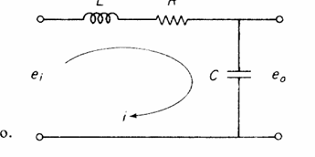

# Funciones de Transferencia

Es un concepto fundamental en el campo de los sistemas de control. Las funciones de transferencia permiten analizar y diseñar sistemas dinámicos, dando facilidad en la comprensión de relación entre entradas y salidas de un sistema. Mediante la función de transformada de Laplace, se pueden representar matemáticamente las ecuaciones diferenciales que describen el comportamiento de estos sistemas, dando un resultado esencial para el control y la estabilidad de procesos industriales y tecnológicos.

## 1. Introducción a las Funciones de Transferencia

Las funciones de transferencia son representaciones matemáticas las cuales relacionan la salida de un sistema con su entrada en el dominio de la frecuencia. Este concepto es crucial para el análisis de sistemas de control, dado que permite optimizar y simplificar el estudio de sistemas complejos mediante el uso de herramientas matemáticas. Una función de transferencia proporciona una forma de entender, las respuestas de un sistema a diferentes entradas, lo brinda datos importantes para el diseño de controladores que mantengan el sistema en un estado deseado.

## 2. Definiciones

🔑 _Función de Transferencia_: Es la transformada de Laplace de la ecuación diferencial que describe un sistema, la cual representa la relación entre la salida y la entrada del mismo. Se expresa generalmente como $$\( G(s) = \frac{Y(s)}{U(s)} \)$$, donde $$\( Y(s) \)$$ es la salida y $$\( U(s) \)$$ es la entrada en el dominio de Laplace.

🔑 _Sistema Dinámico_: Sistema que cambia con el tiempo y cuya salida depende de su entrada y de su estado anterior.

🔑 _Estabilidad_: La propiedad de un sistema que indica que, ante una perturbación o un cambio en la entrada, el sistema regresará a su estado de equilibrio o a un comportamiento deseado.

🔑 _Polos_: Los valores de (s) que hacen que el denominador de la función de transferencia sea cero.

🔑 _Ceros_: Los valores de (s) que hacen que el numerador de la función de transferencia sea cero.

🔑 _Respuesta Transitoria_: La parte de la respuesta de un sistema que ocurre inmediatamente después de un cambio en la entrada.

🔑 _Respuesta Estacionaria_: La parte de la respuesta de un sistema que se establece después de que la respuesta transitoria ha desaparecido.

🔑 _Controlador PID_: Un tipo de controlador que utiliza tres acciones de control: proporcional (P), integral (I) y derivativa (D).

🔑 _Transformada de Laplace_: Una técnica matemática que convierte funciones del tiempo en funciones del dominio de la frecuencia.

🔑 _Función de Transferencia de Sistema en Lazo Cerrado_: La relación entre la salida y la entrada de un sistema que incluye retroalimentación.

🔑 _Función de Transferencia de Sistema en Lazo Abierto_: La relación entre la salida y la entrada de un sistema sin considerar la retroalimentación.

## 3. Componentes de un Sistema de Control

### 3.1. Planta
Es el componente físico que realiza el proceso de control. Los ejemoplos de este pueden ser un tanque, un motor, o cualquier sistema que se desee controlar. Acá tambíen ocurre la transformación de la entrada en salida. Por ejemplo, en un sistema de control de temperatura, la planta sería el horno que calienta el aire.

### 3.2. Actuador
Es el componente que recibe la señal de control y actúa sobre la planta para modificar su comportamiento, un ejemplo puede ser que en un sistema de control de temperatura, el actuador seria una válvula que regula el flujo de aire caliente. La efectividad del actuador es crucial para la respuesta del sistema, ya que debe ser capaz de realizar ajustes rápidos y precisos en respuesta a las señales del controlador.

### 3.3. Sensor
Este mide la salida del sistema y genera los reportes con la información del estado actual de la planta. En el caso del control de temperatura, un termopar podría ser utilizado para medir la temperatura del aire en el horno. Para que esta acción sea efectiva la precisión y la rapidez del sensor son vitales, ya que cualquier retraso o error de medición puede afectar la estabilidad y el rendimiento del sistema.

### 3.4. Controlador
Es el componente que toma decisiones con base a la comparación entre la salida medida y el valor deseado, generando señal de control adecuada. se tienen  diferentes tipos de controlador, como lo son el controlador proporcional (P), integral (I) y derivativo (D), estos pueden ser combinados en un controlador PID. La elección adecuada es fundamental para que se garantice que el sistema responda efectivamente a las perturbaciones y mantenga la salida en el valor deseado.

## 4. Ejemplos

💡 **Ejemplo 1**: Consideremos un sistema de control de temperatura en un horno. 

### 4.1. Descripción del Sistema
- **Planta**: Horno
- **Entrada**: Caudal de aire
- **Sensor**: Termopar
- **Salida**: Temperatura
- **Actuador**: Válvula

### 4.2. Funcionamiento del Sistema
1. **Entrada**: Si un caudal de aire ingresa al horno, la cual se considera la entrada del sistema. Esta entrada puede ser controlada manualmente o automáticamente. El caudal de aire afecta directamente la temperatura del horno, por lo que es esencial regularlo adecuadamente.

2. **Sensor**: Un termopar mide la temperatura actual en el horno. Este sensor convierte la temperatura en una señal eléctrica hacia el controlador. La señal del sensor debe ser precisa y rápida para que el controlador pueda reaccionar a tiempo ante cualquier cambio en la temperatura.

3. **Controlador**: El controlador compara la temperatura medida (salida) con la temperatura deseada (setpoint). Si se presentan diferencias con su respectivo rango de error, el controlador calcula el error y decide cómo ajustar la entrada para minimizarlo. Por ejemplo, si la temperatura medida es inferior a la deseada, el controlador puede aumentar el caudal de aire.

4. **Actuador**: Basado en la decisión del controlador, el actuador (en este caso la válvula) debe ajustarse para manejar el caudal de aire que entra en el sistema (Horno). Si la temperatura es demasiado baja, la válvula se abre para permitir un mayor flujo de aire caliente. Si la temperatura es demasiado alta, la válvula se cierra. La rapidez y precisión son importantes para mantener el valor deseado.

### 4.3. Función de Transferencia del Sistema
Para analizar este sistema, se puede establecer una ecuación diferencial que relacione la entrada y la salida. Supongamos que la dinámica del horno se puede modelar con la siguiente ecuación diferencial:

$$
\tau \frac{dT(t)}{dt} + T(t) = K \cdot U(t)
$$

donde:
- T(t) es la temperatura en el tiempo \(t\),
- U(t) es el caudal de aire,
- \(K\) es la ganancia del sistema,
- $$\(\tau\)$$ es la constante de tiempo del sistema.

### 4.4. Transformada de Laplace
Aplicando la transformada de Laplace a la ecuación diferencial, se obtiene:

$$
\tau s T(s) + T(s) = K \cdot U(s)
$$

Despejando \(T(s)\):

$$
T(s) = \frac{K}{\tau s + 1} U(s)
$$

### 4.5. Interpretación de la Función de Transferencia
La función de transferencia $$\(G(s) = \frac{T(s)}{U(s)} = \frac{K}{\tau s + 1}\)$$ describe cómo la salida (temperatura) responde a la entrada (caudal de aire). 

- **Polos**: El término $$\(\tau s + 1 = 0\)$$ tiene un polo en $$\(s = -\frac{1}{\tau}\)$$, lo que indica la estabilidad del sistema. Un polo en el semiplano izquierdo sugiere que el sistema es estable, mientras que un polo en el semiplano derecho indicaría inestabilidad.

- **Ceros**: En este caso, no hay ceros en la función de transferencia, lo que significa que no hay valores de $$\(s\)$$ que hagan que el numerador sea cero. Esto implica que el sistema no tiene un comportamiento de respuesta instantánea a la entrada.

### 4.6. Respuesta del Sistema
La respuesta del sistema a una entrada escalón (un cambio repentino en el caudal de aire) se puede analizar utilizando la función de transferencia. La respuesta temporal se puede obtener aplicando la transformada inversa de Laplace a $$\(T(s)\)$$, lo que permite visualizar cómo la temperatura del horno se ajusta a lo largo del tiempo después de un cambio en la entrada.

## 5. Ecuaciones
Las funciones de transferencia se pueden expresar como:

$$ G(s) = \frac{Y(s)}{U(s)} $$

donde Y(s) es la transformada de Laplace de la salida y U(s) es la transformada de Laplace de la entrada.

### 5.1. Derivación de la Función de Transferencia
Para entender mejor cómo funcionan las ecuaciones de las funciones de transferencia, consideremos el proceso de derivación de la función de transferencia a partir de una ecuación diferencial.

- **Ecuación Diferencial:** Comenzamos con una ecuación diferencial que describe el sistema. Por ejemplo, la ecuación del horno:

$$\tau \frac{dT(t)}{dt} + T(t) = K \cdot U(t)$$

- **Aplicación de la Transformada de Laplace:** Aplicamos la transformada de Laplace a cada término de la ecuación. Recordemos que la transformada de Laplace de una derivada es:

$$
\mathcal{L}\left(\frac{dy(t)}{dt}\right) = sY(s) - y(0)
$$

Aplicando esto a nuestra ecuación, obtenemos:

$$ \tau (sT(s) - T(0)) + T(s) = K \cdot U(s) $$

Despeje de T(s): Reorganizamos la ecuación para despejar (T(s)):

$$ \tau s T(s) + T(s) = K \cdot U(s) + \tau T(0) $$

Factorizando T(s):

$$ T(s)(\tau s + 1) = K \cdot U(s) + \tau T(0) $$

Finalmente, despejamos T(s):

$$ T(s) = \frac{K \cdot U(s) + \tau T(0)}{\tau s + 1} $$

- **Función de Transferencia:** La función de transferencia se define como la relación entre la salida y la entrada en el dominio de Laplace, ignorando las condiciones iniciales (asumiendo que son cero):

$$ G(s) = \frac{T(s)}{U(s)} = \frac{K}{\tau s + 1} $$

### 5.2. Utilidad de la Función de Transferencia
La función de transferencia es útil por varias razones:

- **Análisis de Estabilidad:** Permite determinar la estabilidad del sistema al analizar la ubicación de los polos en el plano complejo. Un sistema es estable si todos los polos están en el semiplano izquierdo.

- **Respuesta en Frecuencia:** Facilita el análisis de la respuesta en frecuencia del sistema, lo que es esencial para el diseño de controladores. Se pueden utilizar técnicas como el diagrama de Bode para evaluar cómo el sistema responde a diferentes frecuencias de entrada.

- **Diseño de Controladores:** Proporciona una base para el diseño de controladores, como PID, que pueden ajustarse para lograr un rendimiento deseado en términos de tiempo de respuesta, sobreimpulso y estabilidad.

- **Simulación:** Permite simular el comportamiento del sistema en diferentes condiciones, lo que es útil para la validación del diseño antes de implementar el sistema en la práctica.

## 6. Entradas y Control de Sistemas
Las entradas a un sistema de control son fundamentales, puesto que estas determinan cómo el sistema puede responder y determinar su comportamiento. Existen diferentes tipos de entradas que se pueden utilizarce en un sistema, y cada una de ellas tiene un resultado distinto en la respuesta del sistema. A continuación, se describen algunos tipos comunes de entradas y cómo se utilizan para controlar sistemas.

### 6.1. Tipos de Entradas
🔑 **Entrada Escalón**: Es una entrada que considera un cambio de nivel repentino. Se utiliza para evaluar la respuesta del sistema a un cambio instantáneo en la entrada. Matemáticamente, se puede representar como:

$$ u(t) = \begin{cases} 0 & \text{para } t < 0 \ A & \text{para } t \geq 0 \end{cases} $$

donde (A) es la magnitud del escalón. La respuesta del sistema a una entrada escalón es crucial para analizar la estabilidad y el tiempo de establecimiento del sistema.

🔑 **Entrada Rampa**: Es una entrada que varía en el tiempo de forma lineal. Se utiliza para evaluar cómo el sistema responde a un cambio gradual en la entrada. Se puede representar como:

$$ u(t) = \begin{cases} 0 & \text{para } t < 0 \ At & \text{para } t \geq 0 \end{cases} $$

donde (A) es la pendiente de la rampa. La respuesta a una entrada rampa ayuda a entender cómo el sistema maneja cambios continuos en la entrada.

🔑 **Entrada Parábola**: Es una entrada que considera una variación no lineal en el tiempo, lo cual permite evaluar diferentes condiciones de inicio y final. Se puede representar como:

$$ u(t) = \begin{cases} 0 & \text{para } t < 0 \ At^2 & \text{para } t \geq 0 \end{cases} $$

donde (A) es un coeficiente que determina la forma de la parábola. Este tipo de entrada es útil para analizar la respuesta del sistema a cambios más complejos.

### 6.2. Control de Sistemas
ESto implica ajustar las entradas para lograr un comportamiento deseado en los resultados del sistema. Para que estos controles sean efectivos, es necesario seguir un proceso que incluya un cilo de medición, comparación y ajuste de entradas. 

A continuación se describira los pasos clave en el control de sistemas:

- **Medición de la Salida**: Utilizando sensores, se mide la salida del sistema. Esta medición proporciona información sobre el estado actual del sistema y es esencial para el control.

- **Comparación con el Valor Deseado**: La salida medida se compara con el valor deseado (setpoint). Esta comparación genera un error, que es la diferencia entre la salida deseada y la salida real.

$$ \text{Error} = \text{Salida Deseada} - \text{Salida Medida} $$

- **Decisión del Controlador**: Basado en el error, el controlador toma decisiones sobre cómo ajustar la entrada. Existen diferentes estrategias de control, como:

  **Control Proporcional (P)**: La acción de control es proporcional al error. Un mayor error resulta en un mayor ajuste en la entrada.
  
  **Control Integral (I)**: Se considera el error acumulado a lo largo del tiempo, lo que ayuda a eliminar el error en estado estacionario.
  
  **Control Derivativo (D)**: Se basa en la tasa de cambio del error, lo que permite anticipar cambios y mejorar la estabilidad del sistema.
  
  **Ajuste de la Entrada**: El controlador envía una señal al actuador para ajustar la entrada del sistema. Este ajuste puede ser un cambio en el caudal de aire, la posición de una válvula, o cualquier otra variable que afecte la salida.

- **Retroalimentación**: La salida ajustada se vuelve a medir, y el proceso se repite. Este ciclo de medición, comparación, decisión y ajuste es fundamental para mantener el sistema en el estado deseado.

## 7. Clasificación de funciones de transferencia

| Tipo de Función de Transferencia | Grado del Numerador (n) |
|----------------------------------|--------------------------|
| Impropria                        | n > m                    |
| Estrictamente Propia             | m > n                    |
| Bipropia                         | n = m                    |                            

Tabla 1. Clasificación de funciones de transferencia.

### 7.1. Detalle de la Clasificación
🔑 - Funciones Improprias: Estas funciones tienen un grado del numerador mayor que el del denominador (n > m). Significando que a medida que la frecuencia se vuelve muy alta, la salida del sistema puede crecer sin límite, generando un comportamiento inestable. En el diseño de sistemas, se deben evitar estas funciones, ya que pueden llevar a respuestas no deseadas.

🔑 - Funciones Estrictamente Propias: Estas funciones tienen el grado del denominador es mayor que el del numerador (m > n). Esto indica que el sistema tiene un comportamiento estable y que la salida se mantendrá finita a medida que la frecuencia aumenta. Estas funciones son deseables en el diseño de sistemas de control, ya que garantizan que el sistema pueda controlarse con variaciones de frecuencia.

🔑 - Funciones Bipropias: Aquí, el grado del numerador es igual al del denominador (n = m). Estas funciones pueden tener un comportamiento más complejo, su análisis requiere un estudio detallado de los polos y ceros. Dependiendo de la ubicación de estos, el sistema puede ser estable o inestable.

### 7.2. Ejemplo de Clasificación
Para ilustrar la clasificación de funciones de transferencia, consideremos los siguientes ejemplos:

Función Impropria: $$G(s) = \frac{2s^3 + 3s^2 + 1}{s^2 + 4}$$

Aquí, el numerador tiene un grado de 3 y el denominador un grado de 2, por lo que es impropia.
Función Estrictamente Propia: $$G(s) = \frac{3s + 2}{s^2 + 5s + 6}$$

En este caso, el numerador tiene un grado de 1 y el denominador un grado de 2, lo que la clasifica como estrictamente propia.
Función Bipropia: $$G(s) = \frac{s^2 + 2s + 1}{s^2 + 3s + 2}$$

Aquí, tanto el numerador como el denominador tienen un grado de 2, por lo que es bipropia.

## 8. Ejercicios
# 📌 Problema: Función de Transferencia de un Circuito RLC en Serie  

.

## 🔹 **Planteamiento del Problema**  
Se tiene un circuito eléctrico conformado por:  
- Un **inductor** de inductancia \( L \)  
- Un **resistor** de resistencia \( R \)  
- Un **capacitor** de capacitancia \( C \)  

Este circuito recibe como entrada una señal de voltaje \( e_i(t) \) y genera una salida \( e_o(t) \). Se desea encontrar la **función de transferencia**, es decir, la relación entre la salida y la entrada en el dominio de Laplace.

---

## 🔹 **Paso 1: Aplicar la Ley de Kirchhoff de Voltajes**  
La ecuación diferencial que rige el circuito se obtiene aplicando la Ley de Kirchhoff:  

$$L \frac{di}{dt} + Ri + \frac{1}{C} \int i \, dt = e_i$$

También se tiene la ecuación de voltaje en el capacitor:

$$\frac{1}{C} \int i \, dt = e_o$$

---

## 🔹 **Paso 2: Transformada de Laplace**  
Aplicamos la **Transformada de Laplace** a ambas ecuaciones, suponiendo condiciones iniciales nulas.  

- Para el inductor:  
  $$L \mathcal{L} \left[ \frac{di}{dt} \right] = L s I(s) $$
- Para la resistencia:  
  $$R i(t) \quad \rightarrow \quad R I(s)$$
- Para el capacitor (usando que la integral en Laplace es \( \frac{1}{s} \)):  
  $$\frac{1}{C} \mathcal{L} \left[ \int i \, dt \right] = \frac{1}{C} \frac{1}{s} I(s) $$

Sustituyendo estas expresiones en la ecuación de Kirchhoff:  

$$L s I(s) + R I(s) + \frac{1}{C} \frac{1}{s} I(s) = E_i(s)$$

Para la salida:  

$$E_o(s) = \frac{1}{C} \frac{1}{s} I(s)$$

---

## 🔹 **Paso 3: Función de Transferencia**  
Despejamos \( I(s) \) de la ecuación de entrada:  

$$I(s) \left( Ls + R + \frac{1}{Cs} \right) = E_i(s)$$

$$I(s) = \frac{E_i(s)}{Ls + R + \frac{1}{Cs}}$$

Sustituyendo en la ecuación de salida:  

$$E_o(s) = \frac{1}{Cs} I(s) = \frac{1}{Cs} \cdot \frac{E_i(s)}{Ls + R + \frac{1}{Cs}}$$

Finalmente, la función de transferencia es:  

$$H(s) = \frac{E_o(s)}{E_i(s)} = \frac{1}{LCs^2 + RCs + 1}$$

La función de transferencia obtenida es:  

$$H(s) = \frac{1}{LCs^2 + RCs + 1}$$

## 9. Conclusiones
En este docuemtno hemos abordado el concepto de funciones de transferencia y su relevancia en el análisis y diseño de sistemas de control. A continuación, se presentan las conclusiones estructuradas en varios puntos clave:

- ### 9.1. Importancia de las Funciones de Transferencia
Relación Entrada-Salida: Las funciones de transferencia proporcionan una representación matemática clara de la relación entre la entrada y la salida de un sistema, lo que facilita el análisis del comportamiento dinámico del mismo.

Simplificación del Análisis: Al utilizar la transformada de Laplace, se simplifican las ecuaciones diferenciales que describen el sistema, permitiendo trabajar en el dominio de la frecuencia en lugar del dominio del tiempo.
- ### 9.2. Estabilidad y Respuesta del Sistema
Análisis de Estabilidad: La ubicación de los polos en el plano complejo es fundamental para determinar la estabilidad del sistema. Un sistema es considerado estable si todos sus polos se encuentran en el semiplano izquierdo.

Respuesta Transitoria y Estacionaria: Se ha discutido la diferencia entre la respuesta transitoria, que ocurre inmediatamente después de un cambio en la entrada, y la respuesta estacionaria, que es el comportamiento del sistema a largo plazo. Comprender estas respuestas es crucial para el diseño de controladores efectivos.
- ### 9.3. Controladores y Estrategias de Control
Controladores PID: Se ha destacado la importancia de los controladores PID (Proporcional, Integral, Derivativo) en el control de sistemas. Estos controladores permiten ajustar la entrada de manera que se minimice el error entre la salida medida y la salida deseada.

Ciclo de Control: El proceso de control implica un ciclo continuo de medición, comparación, decisión y ajuste, lo que garantiza que el sistema se mantenga en el estado deseado a pesar de las perturbaciones.

## 10. Referencias
Ogata, K. (2010). Ingeniería de Control Moderna. Pearson.

 Ing. Jorge Eduardo Cote Ballesteros (2023)

