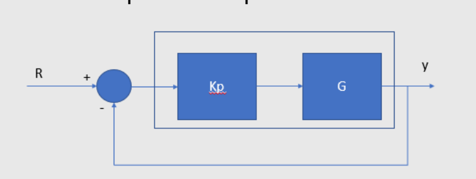

# Error de estado estacionario

## 1. Introducción 

En este resumen se explicará cómo funciona el error en estado estacionario, cuáles son sus efectos en el sistema, como calcularlo frente a distintos tipos de entradas, cuáles son sus fundamentos teóricos y como puede afectar la salida de nuestra planta. Este error tiene repercusiones en la salida de nuestro sistema después de que el sistema haya alcanzado un régimen en nuestro sistema, por lo que es crucial entender cómo funciona este error para minimizarlo lo más que se pueda para que nuestro sistema funcione correctamente como se pronostica.   

## 2. Función de error  

La función de error se encarga de medir la diferencia entre la salida y la función de transferencia cuando el sistema tiende a un tiempo infinito 

.

Figura 1. función de error

En la imagen tenemos el error que afecta a nuestra entrada y salida.

$$E = R - y$$

$$y = EG$$

Despejamos las ecuaciones en términos del error 

$$E = R - EG$$

$$E = \frac{R}{1+G}$$

Y obtenemos el error en estado estacionario 

## 3. Cálculo del error en estado estacionario 

Para calcular el error en estado estacionario necesitamos aplicar el teorema del valor final para medir la diferencia entre la salida y la función de transferencia en un tiempo infinito.

$$s\lim_{s \to 0} * E(s) = \lim_{s \to 0} * \frac{sR(s)}{1 + G(s)}$$

Y nuestra respuesta cambiara en base a la entrada que le metamos al sistema

### 3.1. Respuesta entrada escalón unitario 

Ante una entrada escalón, tendremos una entrada escalón unitario.

$$R(S) = \frac{1}{s}$$

Por lo que aplicando la entrada escalón al teorema del valor final tendremos lo siguiente:

$$E = \lim_{s \to 0} * \frac{sR(s)}{1 + G(s)}$$

$$\lim_{s \to 0} * \frac{s * \frac{1}{s}}{1 + G(s)}$$

$$\lim_{s \to 0} * \frac{1}{1 + G(s)}$$

Una vez resuelta la ecuación tendremos la solución a las entradas escalón; lo cual es igual al error de posición. 

$$E_{ssp} = \frac{1}{1 + G(0)}$$

### 3.2. Respuesta entrada rampa

$$R(S) = \frac{1}{s^{2}}$$

Aplicando la entrada rampa al teorema del valor final.

$$E = \lim_{s \to 0} * \frac{sR(s)}{1 + G(s)}$$

Despejamos la ecuación 

$$\lim_{s \to 0} * \frac{s * \frac{1}{s^{2}}}{1 + G(s)}$$

$$\lim_{s \to 0}\frac{\frac{1}{s}}{1 + G(s)}$$

Obtenemos que  la ecuación es igual a este limite

$$\lim_{s \to 0}\frac{1}{s + sG(s)}$$

Como no sabemos si G(s) puede simplificar la "s" que está multiplicando, la función quedara con el límite de la siguiente forma:

$$E_{ssv} = \lim_{s \to 0}\frac{1}{sG(s)}$$

Esta ecuación es la que representa la respuesta ante una entrada rampa o un error de velocidad

### 3.3. Respuesta entrada parábola

$$R(S) = \frac{1}{s^{3}}$$

Frente a una entrada parábola hacemos lo mismo de multiplica nuestra entrada por nuestro límite del teorema, y despejamos.

$$E = \lim_{s \to 0} * \frac{sR(s)}{1 + G(s)}$$

$$\lim_{s \to 0} * \frac{s * \frac{1}{s^{3}}}{1 + G(s)}$$

$$\lim_{s \to 0}\frac{\frac{1}{s^{2}}}{1 + G(s)}$$  

$$\lim_{s \to 0}\frac{1}{s^{2} + s^{2}G(s)}$$

En este caso nuestra "s" estará elevada al cuadrado y de la misma manera que en el caso anterior no podremos utilizar el límite todavía.

$$E_{ssa} = \lim_{s \to 0}\frac{1}{s^{2}G(s)}$$ 

Esta es la ecuación que se usa ante una entrada parábola, que representa un error de aceleración.

### 3.4. Ejemplos

Para los siguientes ejercicios se calculará el error de posición, velocidad, y aceleración de cada función de transferencia.

 💡 Ejemplo 1

En el primer ejercicio tenemos la siguiente función

$$G = \frac{5}{s^{3} + 2s^{2} + 5s + 1}$$

Primero le aplicamos la fórmula de la entrada paso, y despejamos.

$$E_{ssp} = \frac{1}{1 + \frac{5}{0^{3} + 2(0)^{2} + 5(0) + 1}}$$
$$E_{ssp} = \frac{1}{1 + \frac{5}{1}} $$
Eso nos dará que nuestro error de posición, que es de $\frac{1}{6}$ 
$$E_{ssp} = \frac{1}{6}$$

Para el segundo caso usamos la fórmula de error de velocidad, y despejamos 

$$E_{ssv} = \lim_{s \to 0}\frac{1}{(s) \frac{5}{s^{3} + 2s^{2} + 5s + }}$$  

Al despejar terminamos con un $\infty$ en el denominador, por lo tanto, nos dará que el error es cero.

$$E_{ssv} = \frac{1}{\infty}$$
$$E_{ssv} = 0$$

Por último, aplicamos la entrada tipo parábola, para luego despejar.

$$E_{ssa} = \lim_{s \to 0}\frac{1}{(s^{2}) (\frac{5}{s^{3} + 2s^{2} + 5s + 1}}$$
$$E_{ssa} = \lim_{s \to 0}\frac{1}{(0^{2}) \frac{5}{0^{3} + 2(0)^{2} + 5(0) + 1}}$$ 

Aquí sucede lo mismo que con una entrada rampa, por lo tanto, esta también nos dará que es igual a cero.

$$E_{ssa} = \frac{1}{\infty} =  0$$

 💡 Ejemplo 2

Esta es la función del segundo ejemplo, es bastante parecida al primer ejemplo, pero es un sistema de segundo orden debido a la "s" que multiplica en el denominador.

$$G = \frac{5}{s(s^{3} + 2s^{2} + 5s + 1)}$$

Aplicamos la fórmula de la posición.

$$E_{ssp} = \frac{1}{1 + \frac{5}{0(0^{3} + 2(0)^{2} + 5(0) + 1)}}$$

El resultado nos da un $\infty$ en el denominador, por lo que la primera es cero.

$$E_{ssp} = \frac{1}{\infty} = 0$$

Para la entrada rampa aplicamos la formula y despejamos.

$$E_{ssv} = \lim_{s \to 0}\frac{1}{(s) \frac{5}{s(s^{3} + 2s^{2} + 5s + 1)}} $$
$$E_{ssv} = \lim_{s \to 0}\frac{1}{ \frac{5}{0^{3} + 2(0)^{2} + 5(0) + 1}} $$

Una vez despejamos obtenemos que nuestro error de velocidad es $\frac{1}{5} $

$$E_{ssv} = \frac{1}{5} $$

Para el error de aceleración aplicamos el límite.

$$E_{ssa} = \lim_{s \to 0}\frac{1}{(s^{2}) \frac{5}{s (s^{3} + 2s^{2} + 5s + 1)}}$$
$$E_{ssa} = \lim_{s \to 0}\frac{1}{(0) \frac{5}{0^{3} + 2(0)^{2} + 5(0) + 1}} $$

Una vez despejado, nuestra ecuación terminara con un cero en el divisor, por lo tanto nuestro error de aceleración es indeterminado.

$$E_{ssa} = \frac{1}{0} =  \infty$$

💡 Ejemplo 3

En el tercer ejemplo tenemos esta función, la cual es parecida a las anteriores, pero es de un sistema de tercer orden.

$$G = \frac{5}{s^{2}(s^{3} + 2s^{2} + 5s + 1)}$$

Para el primer ejercicio aplicamos el teorema 

$$E_{ssp} = \frac{1}{1 + \frac{5}{0^{2}(0^{3} + 2(0)^{2} + 5(0) + 1)}}$$

Una vez despejado nos damos cuenta de que al reemplazar el límite tenemos una "s" que multiplica todo el denominador, por ende, nuestro denominador termina siendo cero, haciendo que el error de posición sea indeterminado.

$$E_{ssp} = \frac{1}{0} = \infty$$

En el segundo aplicamos el teorema para el error de velocidad

$$E_{ssv} = \lim_{s \to 0}\frac{1}{(s) \frac{5}{s^{2}(s^{3} + 2s^{2} + 5s + 1)}} $$
$$E_{ssv} = \lim_{s \to 0}\frac{1}{ \frac{5}{0 * (0^{3} + 2(0)^{2} + 5(0) + 1)}} $$

Es un caso similar al anterior, pues al simplificar obtenemos un cero en el denominador, haciendo que acá también nuestra respuesta sea indeterminada.

$$E_{ssv} = \frac{1}{0} = \infty$$

Por último aplicamos el teorema para el error de aceleración, y despejamos

$$E_{ssa} = \lim_{s \to 0}\frac{1}{(s^{2}) \frac{5}{s^{2} (s^{3} + 2s^{2} + 5s + 1)}}$$
$$E_{ssa} = \lim_{s \to 0}\frac{1}{ \frac{5}{0^{3} + 2(0)^{2} + 5(0) + 1}} $$

En este caso no tenemos el error indeterminado, esto se debe a que se puede simplificar la "s" que nos volvió cero el denominador, haciendo que nuestra respuesta para el error de aceleración sea $\frac{1}{5}$

$$E_{ssa} = \frac{1}{5}$$

### 3.5. Tipos de sistemas 

De los ejemplos anteriores pudimos sacar la conclusión que dependiendo del grado del sistema nuestros sistemas, y la cantidad de polos ubicados en cero nuestra respuesta será diferente, pero seguirá un patrón; como el de la siguiente tabla

| Sistema  | $E_{ssp}$  | $E_{ssv}$  | $E_{ssa}$  |
|---|---|---|---|
| Tipo 0  | k  | $\infty$  | $\infty$  |
| Tipo 1  | k  | k  | $\infty$  |
| Tipo 2  | 0  | 0  | k  |

En donde k será una constante diferente de cero.

## 4. Diseño de controlador 
### 4.1. Corrección del error 

Cuando tenemos un error de estado estacionario en nuestro sistema, podremos reducirlo o eliminarlo con un controlador que modifique nuestra función de transferencia. Esto lo hará multiplicando una variable k por la función de transferencia del sistema, dándonos una nueva ecuación $G_{p} * K_{p}$

💡 Ejemplo con controlador 

G = \frac{s + 4}{(s - 1)}

Para este sistema se diseñará un controlador que garantice un error menor al 10% (Lazo cerrado)

Figura 2. Ejemplo controlador

Lo primero que hacemos es ajustar la ecuación para que todo que como un solo bloque que será nuestra función por $k_{p}$

$$E_{ssp} = \frac{1}{1 + \frac{k_{p}(0 + 4)}{0^{2} + 0(1) - 2}}$$

Usamos la formula del error de posición y despejamos.

$$E_{ssp} = \frac{1}{1 + \frac{k_{p}(4)}{-2}}$$

De lo cual obtenemos el siguiente resultado.

$$E_{ssp} = \frac{-2}{4k_{p} - 2}$$

Una vez obtenido nuestro error, vamos a calcular cuánto debe ser $k_{p}$ para que nuestro error sea menor al 10%. Para esto aplicamos una igualdad entre nuestro error y el porcentaje al cual debe ser menor.

$$|{\frac{-2}{4k_{p} - 2}}| \leq 0.1$$

Despejamos $k_{p}$

$$|-2| \leq 0.4k_{p} - 0.2$$

$$k_{p} \geq \frac{0.2 + 2}{0.4}$$

$$k_{p} \geq 5.5$$

Y al final obtenemos que nuestro $k_{p}$ debe ser mayor o igual a 5.5 para que nuestro error sea menor al 10%

## 5. Sensibilidad 

La sensibilidad se conoce como la variación de los parámetros de la planta afectan a la salida del sistema, ya que como vimos anteriormente estos parámetros infligen cambios en la planta y su salida. Las fórmulas son las siguientes:

La sensibilidad es "P" por el cambio en "F" sobre "F" por el cambio en "P"

$$S_{F:P} = \frac{P\bigtriangleup F}{F\bigtriangleup P}$$

Lo cual es igual a "P" sobre "F" multiplicado por la derivada parcial de "F" sobre "P"

$$S_{F:P} = \frac{F}{P} \frac{\mathrm{d} F}{\mathrm{d} P}$$

## 6. Ejercicios 

 📚 Ejercicio 1

Diseñar un controlador de lazo cerrado que garantice un error de velocidad menor al 5%
 
 $$G(s) = \frac{s + 2}{s^{2} - 4s}$$

Asumimos nuestra ganancia por la función de transferencia es un solo bloque y tenemos alimentación unitaria

.

Figura 3. Error con controlador

Primero usamos la formula del error de velocidad

 $$E_{ssv} = \lim_{s \to 0} (\frac{1}{sG(s)})$$

Luego reemplazamos y despejamos

 $$E_{ssv} = \lim_{s \to 0} (\frac{1}{s(\frac{(s + 2)k_{v}}{s(s-4)})})$$

 $$E_{ssv} = \lim_{s \to 0} (\frac{1}{\frac{k_{v}(0 + 2)}{0 - 4}})$$

Y el error de velocidad nos queda de la siguiente manera

 $$E_{ssv} = \frac{-2}{k_{v}}$$

Sabiendo cual es el error podemos igualarlo al 5% para diseñar el controlador con los parámetros que queremos.

$$|\frac{-2}{k_{v}}| \leq 0.05$$

$$|-2| \leq k_{v}$$

$$k_{v} \geq \frac{2}{0.05}$$

$$k_{v} \geq 40$$

Por lo tanto, si queremos que nuestro error sea menor al 5% nuestra k_{v} debe ser igual o mayor a 40.

📚 Ejercicio 2.

Calcular la sensibilidad, con los siguientes datos:

Go = K 

$$G(s) = \frac{1}{s(s + 4)}$$

H(s) = 3

Ya con los datos los reemplazamos y despejamos la ecuación 

$$S_{A:G} = \frac{1}{1 + (3K)\frac{1}{s(s+4)}}$$

$$S_{A:G} = \frac{1}{\frac{s(s + 4) + 3K}{s+4}}$$

$$S_{A:G} = \frac{s(s+4)}{s^{2} + 4s + 3K}$$

Por lo que tendremos que nuestra sensibilidad será igual a:

$$S_{A:G} = \frac{s^{2} + 4s)}{s^{2} + 4s + 3K}$$

## 7. Síntesis conclusiva.

El error de  estado estacionario nos ayuda a evaluar la precisión de los sistemas de control frente a señales que varían la estabilidad de los sistemas. Frente a las distintas entradas (Paso, rampa, parábola) encontraremos el error de diferentes maneras, y se podrá determinar cuál es la desigualdad entre la salida real y la salida deseada, en un tiempo infinito. 
La función de la sensibilidad nos permite cuantificar como se ve afectado nuestro sistema por errores de medición, perturbaciones o variaciones de nuestra entrada. La cual compara como los criterios de nuestra planta se ven infligidos en la salida.
Comprender como afecta el orden del sistema y los polos nos permite diseñar controladores eficientes y precisos que garanticen una respuesta satisfactoria que cumpla con los criterios de desempeños esperados. por lo que el error en estado estacionario nos sirve como guía para el ajuste de los sistemas dinámicos.

## 8. Referencias 

N. Nise, Control System Engineering, 6th edition. John Wiley Editorial

