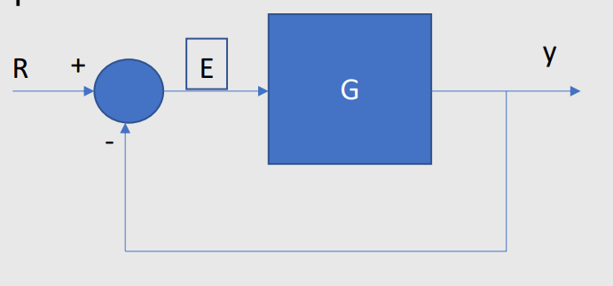

# Error de estado estacionario

## 1. Introduccion 

## 2. Funcion de error  

La funcion de error se encarga de medir la diferencia entre la salida y la funcion de transferencia cuando el sistema tiende a un tiempo infinito 

.

En la imagen tenemos el error que afecta a nuestra entrada y salida.

$$E = R - y$$

$$y = EG$$

Despejamos las ecuaciones en terminos del error 

$$E = R - EG$$

$$E = \frac{R}{1+G}$$

Y obtenemos el error en estado estacionario 

## 3. Calculo del error en estado estacionario 

Para calcular el error en estado estacionario necesitamos aplicar el teorema del valor final para medir la diferencia entre la salida y la funcion de tranferencia en un tiempo infinito.

$$s\lim_{s \to 0} * E(s) = \lim_{s \to 0} * \frac{sR(s)}{1 + G(s)}$$

Y nuestra respuesta cambiara en base a la entrada que le metamos al sistema

### 3.1. Respuesta entrada escalon unitario 

Ante una entrada escalon, tendremos una entrada escalon unitario.

$$R(S) = \frac{1}{s}$$

Por lo que nuestra respuesta quedara de la siguiente manera 

$$E = \lim_{s \to 0} * \frac{sR(s)}{1 + G(s)}$$

$$\lim_{s \to 0} * \frac{s * \frac{1}{s}}{1 + G(s)}$$

$$\lim_{s \to 0} * \frac{1}{1 + G(s)}$$

$$E_{ssp} = \frac{1}{1 + G(0)}$$

### 3.2. Respuesta entrada rampa

$$R(S) = \frac{1}{s^{2}}$$

$$E = \lim_{s \to 0} * \frac{sR(s)}{1 + G(s)}$$

$$\lim_{s \to 0} * \frac{s * \frac{1}{s^{2}}}{1 + G(s)}$$

$$\lim_{s \to 0}\frac{\frac{1}{s}}{1 + G(s)}$$

$$\lim_{s \to 0}\frac{1}{s + sG(s)}$$

$$E_{ssv} = \lim_{s \to 0}\frac{1}{sG(s)}$$

### 3.3. Respuesta entrada parabola

$$R(S) = \frac{1}{s^{3}}$$

$$E = \lim_{s \to 0} * \frac{sR(s)}{1 + G(s)}$$

$$\lim_{s \to 0} * \frac{s * \frac{1}{s^{3}}}{1 + G(s)}$$

$$\lim_{s \to 0}\frac{\frac{1}{s^{2}}}{1 + G(s)}$$  

$$\lim_{s \to 0}\frac{1}{s^{2} + s^{2}G(s)}$$

$$E_{ssa} = \lim_{s \to 0}\frac{1}{s^{2}G(s)}$$ 

### 3.4. Ejemplo 

Primero

$$E_{ssp} = \frac{1}{1 + \frac{5}{0^{3} + 2(0)^{2} + 5(0) + 1}}$$
$$E_{ssp} = \frac{1}{1 + \frac{5}{1}} $$
$$E_{ssp} = \frac{1}{6}$$

$$E_{ssv} = \lim_{s \to 0}\frac{1}{(s) \frac{5}{s^{3} + 2s^{2} + 5s + }}$$  
$$E_{ssv} = \frac{1}{0}$$
$$E_{ssv} = infty$$

$$E_{ssa} = \lim_{s \to 0}\frac{1}{(s^{2}) (\frac{5}{s^{3} + 2s^{2} + 5s + 1}}$$
$$E_{ssa} = \lim_{s \to 0}\frac{1}{(0^{2}) \frac{5}{0^{3} + 2(0)^{2} + 5(0) + 1}}$$ 
$$E_{ssa} = \frac{1}{0} =  infty$$

Segundo

$$E_{ssp} = \frac{1}{1 + \frac{5}{0(0^{3} + 2(0)^{2} + 5(0) + 1)}}$$
$$E_{ssp} = \frac{1}{infty} = 0$$

$$E_{ssv} = \lim_{s \to 0}\frac{1}{(s) \frac{5}{s(s^{3} + 2s^{2} + 5s + 1)}} $$
$$E_{ssv} = \lim_{s \to 0}\frac{1}{ \frac{5}{0^{3} + 2(0)^{2} + 5(0) + 1}} $$
$$E_{ssv} = \frac{1}{5} $$

$$E_{ssa} = \lim_{s \to 0}\frac{1}{(s^{2}) \frac{5}{s (s^{3} + 2s^{2} + 5s + 1)}}$$
$$E_{ssa} = \lim_{s \to 0}\frac{1}{(0) \frac{5}{0^{3} + 2(0)^{2} + 5(0) + 1}} $$
$$E_{ssa} = \frac{1}{0} =  infty$$

Tercero

$$E_{ssp} = \frac{1}{1 + \frac{5}{0^{2}(0^{3} + 2(0)^{2} + 5(0) + 1)}}$$
$$E_{ssp} = \frac{1}{infty} = 0$$

$$E_{ssv} = \lim_{s \to 0}\frac{1}{(s) \frac{5}{s^{2}(s^{3} + 2s^{2} + 5s + 1)}} $$
$$E_{ssv} = \lim_{s \to 0}\frac{1}{ \frac{5}{0 * (0^{3} + 2(0)^{2} + 5(0) + 1)}} $$
$$E_{ssv} = \frac{0}{5} = 0$$

$$E_{ssa} = \lim_{s \to 0}\frac{1}{(s^{2}) \frac{5}{s^{2} (s^{3} + 2s^{2} + 5s + 1)}}$$
$$E_{ssa} = \lim_{s \to 0}\frac{1}{ \frac{5}{0^{3} + 2(0)^{2} + 5(0) + 1}} $$
$$E_{ssa} = \frac{1}{5}$$

### 3.5. Tipos de sistemas 

## 4. Diseño de controlador 
### 4.1. Correccion del error 

### 4.2. Ejemplo 1

### 4.3. Ejemplo con controlador 

## 5. Sensibilidad 

### 5.1 Ejemplo

## 6. Ejercicios 

## 7. Conclusiones 

## 8.Referencias 

