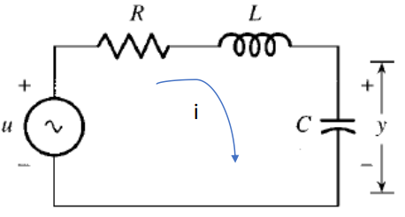
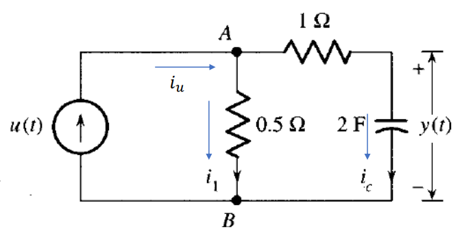

# Sistemas-de-control
Apuntes sistemas de control 2025-1

# Sistemas electricos

## Introduccion 
El modelamiento de sistemas electricos es muy importante cuando tenemos que predecir la dinamica de un circuito RLC, mediante representaciones matematicas. Estos circuitos estan compuestos por Resistencias (R), capacitores (C) e inductancias  (L), las cuales se resuelven con la ley de ohm, y las leyes de Kirchhoff (mallas y nodos). Estas se resuelven mediante ecuaciones diferenciales, las cuales estan relacionadas con la corriente y tension en el dominio del tiempo    

## 1. Circuitos RLC 

Los circuitos RLC son sistemas que estan compuestos por Resistencias, Capacitores e inductancias, del cual podemos determinar como funciona su modelo dinamico dependiendo de su señal de entrada, y su configuracion (Serie, Paralelo, Mixto). Para poder modelar los circuitos aplicamos la ley de ohm o las leyes de kirchoff. Para poder hacer esto tenemos que tener presentes las ecuaciones de la ley de ohm, de carga de un condensador y carga de un inductor.

  - Ley de ohm
    
$R=\frac{v(t)}{i(t)}$

  - Carga de un condesador

 $i(t)= C\frac{dv(t)}{dt}$

   - Carga de un inductor

$v(t)= L\frac{di(t)}{dt}$ 

## 2. Ejemplos 
### 2.1 Primer ejemplo

.

Figura 1. Ejemplo1

En este primer ejemplo tenemos un circuito en serie, y necesitamos modelarlo para que quede en terminos del voltaje que pasa por nuestro condensador [y(t)]

Lo primero que hacemos es aplicar la ley de kirchoff de mallas, en donde todos los voltajes de la malla son iguales a cero

$-u + v_{R} + v_{L} + v_{C} = 0$

Luego tomamos los voltajes y los remplazamos con las variables que conocemos.

$-u(t) + i(t) * R + l\frac{di(t)}{dt} + y(t) = 0$

Despues hacemos que todo quede con los mismo terminos, que serian los del condesador [y(t)]. Aplicando la formula de carga del condesador podemos dejar en terminos de y(t) la inductancia del circuito.

$i(t) = C\frac{dy(t)}{dt}$

$-u(t) + R*C\frac{dy(t)}{dt} + (L\frac{d}{dt})(C\frac{dy(t)}{dt}) + y(t) = 0$

Por ultimo multiplicamos los terminos reemplazados anteriormente y organizamos la ecuacion para dejarla modelada.

$-u(t) + R*C\frac{dy(t)}{dt} + LC\frac{d^{2}y(t)}{dt^{2}} + y(t) = 0$

### 2.2 Segundo ejemplo

.

Figura 2. Ejemplo 2

Para el segundo ejemplo tambien buscaremos el voltaje que pasa por y(t).

Lo primero que haremos es aplicar la ley de kirshoff de nodos, donde tomamos todas las corrientes del circuito y las iguales a cero.

$i_{u} - i_{1} - i_{c} = 0$

Luego reemplazamos en la formula las corrientes con los valores que vemos en la imagen.

$i_{u}(t) - \frac{V_{AB}}{0.5} - 2\frac{dy(t)}{dt} = 0$

Despues determinamos a cuanto equivale $V_{AB}$, el cual es igual al voltaje que pasa por la resistencia mas el voltaje del condensador. Sabiendo que el voltaje de la resistencia es el valor de la misma por la corriente que pasa $(i_{c})$; y el voltaje que pasa por el condensador es y(t).
Sabiendo que $i_{c} = 2\frac{dy(t)}{dt}$ lo reemplazamos en la ecuacion para que todo nos quede en terminos de y(t)

$V_{AB} = i_{c}*1 + y(t)$

$V_{AB} = 2\frac{dy(t)}{dt} + y(t)$

Lo siguiente que se hace es reemplazar $V_{AB}$ en la ecuacion principal.

$u(t) - \frac{2dy(t)}{0.5dt} - y(t)\frac{1}{0.5} - 2\frac{dy(t)}{dt} = 0$

Por ultimo se despeja la ecuacion y se organiza para que se pueda entender como es el modelo 

$u(t) - 6\frac{dy(t)}{dt} - 2y(t) = 0$

# 3. Ejercicios 

## 4. Conclusiones
Agregue unas breves conclusiones sobre los temas trabajados en cada clase, puede ser a modo de resumen de lo trabajado o a indicando lo aprendido en cada clase

## 5. Definiciones
Utilice el símbolo '>' para crear bloques de texto. En la presente plantilla estas cajas están reservadas para resaltar las definiciones, las cuales deben ser breves, y la palabra o frase que se está definiendo debe estar en letra itálica. El inicio del bloque de texto debe realizarse con el emoji 🔑 .
>🔑 *Definición:* descripción precisa y clara del significado de una palabra, término, concepto o fenómeno. Es una explicación que establece los límites y el alcance de aquello que se está definiendo, aclarando su naturaleza, características esenciales y, en algunos casos, su relación con otros conceptos.

## 9. Ejercicios
Deben agregar 2 ejercicios con su respectiva solución, referentes a los temas tratados en cada una de las clases. Para agregar estos, utilice la etiqueta #, es decir como un nuevo título dentro de la clase con la palabra 'Ejercicios'. Cada uno de los ejercicios debe estar numerado y con su respectiva solución inmediatamente despues del enunciado. Antes del subtitulo de cada ejercicio incluya el emoji 📚 

## 6. Referencias

