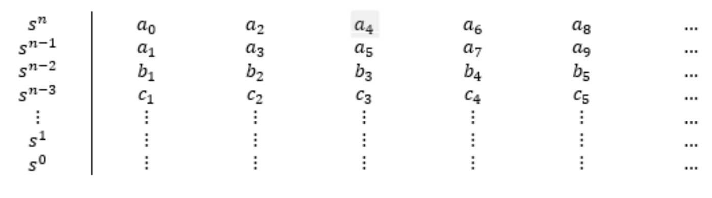

# ESTABILIDAD

## 1.  Introduccion 

La estabilidad es una pieza fundamental a la hora de analisar y diseñar sistemas, debido a que este afecta el compotamiento que se tiene a lo largo del tiempo de funcionamiento. Los sistemas son considerados estables cuando ante una perturbacion que me afecta el sistema, puede mantenerse controlado, y regresar a un estado donde funcione correctamente.  

En este trabajo se resumira lo visto en la clase, donde se explicaran los distintos metodos para determinar si un sistema es estable, los criterios que se tienen en cuenta, y como diseñar un controlador que nos ayude a estabilizar el sistema, todo esto con ejemplos y ejercicios para comprender mejor el tema

## 2. Teorema del valor final 

Lo primero que se vio en clase fue el teorema del valor final, el cual nos permite determinar el valor aproximado de una funcion en el tiempo, todo en terminos del dominio de Laplace. Este teorema dice:

$$f\lim_{ t\to \infty } (t) = sF\lim_{ s\to 0 } (s)$$

### 💡2.1. Ejemplo 

Para este ejemplo tenemos la siguiente funcion de transferencia
$$G(s) = \frac{Y(s)}{U(s)} = \frac{4}{5s + 1}$$

Lo primero que haremos para probar el teorema del valor final sera despejar la salida del sistema

$$Y(s) = \frac{4*U(s)}{5s+1}$$

Para este ejercicio decidimos trabajar con una entrada escalon, por lo tanto se reemplaza mi entrada por $${\frac{1}{s}}$$

$$Y(s) = \frac{\frac{4}{s}}{5s+1}$$

Para determinar el valor final de Y(s) utilizamos el teorema del valor final  

$$sY\lim_{ s\to 0 } = s\lim_{ s\to 0 }* \frac{\frac{4}{s}}{5s+1}$$

Simplificamos la s, y nos queda una fraccion. Una vez reemplazada la s que multiplica el 5 nos da el valor final de nuestra salida, el cual es 4.

$$\lim_{ s\to 0 } \frac{4}{5s+1} = 4$$

## 3.   Analisas de estabilidad
### 3.1. Analisis por teorema del valor final 

Para hacer el análisis de estabilidad por el método del valor final tendremos que comparar la entrada con la salida de nuestra función, para determinar si están limitadas de la misma forma.

#### 💡3.1.1. Ejemplo 1

En el siguitente ejemplo tenemos una funcion de tipo escalon, que vamos a comprobar si es estable

$$U(S) = \frac{A}{S}$$

Para saber si es estable vamos a usar el metodo del teorema del valor final explicado anteriormete, usando las formulas del limite cuando tiende a cero. 

$$s\lim_{ s\to 0} * U(S)$$

Lo que toca hacer es reemplazar nuestra funcion U(s) en nuestra ecuacion. Despues de eso sinplificamos nuestra "s" del numerador con la que multiplica el limite, y nos da que el resultado del analisis es "A"

$$s\lim_{s \to 0 } * \frac{A}{S} = A$$

Por lo tanto de este sistema podemos entender que es estable, debido a que el valor "A" esta limitado por la entrada

#### 💡3.1.2. Ejemplo 2

Para el segundo ejemplo se desea saber si la siguiente funcion es estable ante una entrada escalon, usando el metodo del teorema del valor final 

$$G = \frac{8}{2s-1}$$

Lo primero que hacemos es aplicar la formula del teorema y reemplazar valores con los de la funcion que tenemos.

$$\lim_{s \to 0} * \frac{A}{S} * \frac{8}{2s-1}$$

Despues de eso simplificamos terminos y reemplazamos la "s" sobrante por cero como indica el limite, dejandonos lo siguiente:

$$\frac{-8A}{1} = -8A$$

Por ultimo simplificamos la funcion y nos queda -8A. Esto significa que la funcion no es estable, esto debido a que el escalon es positivo, pero la respuesta que obtenemo es negativo; por lo que no estan limitados de la misma manera

### 3.2. Analisis por ubicacion de polos 

Este criterio es mas sencillo de probar que el primero, ya que se deben cumplir una condicion para demostrar que el sistema es estable. Segun este analisis el sistema sera estable si sus polos tienen parte real negativa, que cuando se visualice aparezcan en el semiplano izquierdo; si por el contrario alguno de sus polos tienen parte real positiva el sistema sera inestable.

#### 💡3.2.1. Ejemplo 

Tenemos un ejercicio, donde tenemos la funcion de transferencia del sistema

$$G = \frac{8}{2s+1}$$

Lo primero que hacemos es determinar cuales son los polos como lo aprendido en clases anteriores.

$$2s + 1 = 0$$

Despejamos la ecuacion

$$2s = -1$$

$$s = -\frac{1}{2}$$

Se puede afirmar que el sistema es estable, debido a que su polo tiene la parte real negativa

## 4. Criterio de Routh Hurwitz

El polinomio de Hurwitz es uno donde todas sus raices tienen parte real negativa. La ventaja que tiene usar este metodo es que para encontrar el polinomio de Hurwitz no es necesario calcular las raices del polinomio, como con el metodo de ubicacion de polos.

Teniendo el siguiente polinomio se puede explicar como se determina si un polinomio es de hurwitz:

$$a_{0}s^{n} + a_{1}s^{n-1} + ... + a_{n-1}s +  a_{n} = 0 $$

Para saber si es el polinomio que buscamos, ningun coeficiente debe ser cero y todos los coeficientes deben ser positivos. En dado caso que no se cumplan estos criterios el polinomio no sera de Hurwitz.

Lo primero que haremos sera poner nuestros datos desde a1 hasta an, ocupando las dos primeras filas, como se muestra en la siguiente imagen:

.

Para calcular los coeficientes haremos lo siguiente.

.

$$b_{1} = \frac{a_{1}a_{2} - a_{0}a_{3}}{a_{1}}$$

$$b_{2} = \frac{a_{1}a_{4} - a_{0}a_{5}}{a_{1}}$$

$$c_{1} = \frac{b_{1}a_{3} - a_{1}b_{2}}{b_{1}}$$

$$c_{2} = \frac{b_{1}a_{5} - a_{1}b_{3}}{b_{1}}$$

Y siguiendo este patron podremos calcular los coeficientes que necesitamos 

### 💡4.1. Ejemplo 

Para el primer ejemplo tenemos el siguiente polinomio:

$$s^{3} + s^{2} +2s + 24 = 0$$ 

Ponemos nuestras condiciones inciales, que tenemos de nuestro polinomio inicial para calcular los siguientes coeficientes.

|   |   |   |
|---|---|---|
| $s^{3}$  | 1  | 2  |
| $s^{2}$  | 1  | 24  |
| $s^{1}$  |   |   |
| $s^{0}$  |   |   |

Hacemos los calculos de b1 y c1

$$b_{1} = \frac{(1 * 2) - (1 * 24)}{1} = - 22$$

$$c_{1} = \frac{(-22 * 24) - (1 * 0)}{-22} = 24$$

Una vez hecho esto los ponemos en la tabla, con los coeficientes calculados.

|   |   |   |
|---|---|---|
| $s^{3}$  | 1  | 2  |
| $s^{2}$  | 1  | 24  |
| $s^{1}$  | -22  | 0  |
| $s^{0}$  | 24  |   |

## 5. Diseño controlador estable 

El punto de tener varios metodos para determinar la estabilidad de un sistema, esta en poder diseñar un controlador con una ganancia Kp que pueda estabilizar el sistema.

### 5.1.💡 Ejemplo 

Teniendo el siguiente sistema, usaremos el metodo de Rout Hurwitz para determinar si es estable; y en caso de no serlo se buscara el valor de kp para poder estabilizar el sistema.

$$G(s) = \frac{1}{s^{4} + 3s^{3} + 3s^{2} + 2s}$$

Se puede observar que no cumple con uno de los criterios, debido a que uno esta incompleto por lo tantosabemos que es inestable; por lo tanto toca buscar con que ganancia el sistema se estabiliza. 

Lo primero que se hace es calcular el controlador con la formula aprendida en clases anteriores.

$$G_{0}(s) = \frac{K_{p}G(s)}{1 + K_{p}G(s)}$$

Despejamos hasta que nos queda lo siguiente

$$G_{0}(s) = \frac{K_{p}}{ s^{4} + 3s^{3} + 3s^{2} + 2s + K_{p}}$$

Con eso nos queda el polinomio que utilizaremos para encontrar la ganancia

$$s^{4} + 3s^{3} + 3s^{2} + 2s + K_{p} = 0$$

Hacemos la tabla donde agregaremos los criterios que necesitamos 

|   |   |   |   |
|---|---|---|---|
| $s^{4}$  | 1  | 3  | $k_{p}$  |
| $s^{3}$  | 3  | 2  | 0  |
| $s^{2}$  | $\frac{7}{3}$  | $k_{p}$  |   |
| $s^{1}$  | $\frac{\frac{14}{3} - 3k_{p}}{\frac{7}{3}}$  | 0  |   |
| $s^{0}$  | $k_{p}$  |   |   |

$$b_{1} = \frac{(3 * 3) - (1 * 2)}{3} = \frac{7}{3}$$

$$b_{2} = \frac{(3 * k_{p}) - (1 * 0)}{3} = k_{p}$$

$$c_{1} = \frac{(\frac{7}{3} * 2) - (3 * k_{p})}{\frac{7}{3}} = \frac{\frac{14}{3} - 3k_{p}}{\frac{7}{3}}$$

$$d_{1} = \frac{\frac{\frac{14}{3} - 3k_{p}}{\frac{7}{3}} * k_{p} - \frac{7}{3} * 0}{\frac{\frac{14}{3} - 3k_{p}}{\frac{7}{3}}} = k_{p}$$

Una vez obtenidos todos los criterios podemos usar los ultimos dos para obtener en que valor tendremos la ganancia para que el sistema sea estable. 

$$\frac{\frac{14}{3} - 3k_{p}}{\frac{7}{3}} > 0$$

$$\frac{14}{3} - 3k_{p} > 0$$

$$k_{p} < \frac{14}{9}$$

Primero despejamos Kp de C1, y eso nos dio que la ganancia debe ser menor a $\frac{14}{9}$ 

$$k_{p} > 0$$

Despues con d1 es mas sencillo, ya que sabemos que nuestra ganancia es mayor a cero 

$$0 < k_{p} < \frac{14}{9}$$

Por lo tanto nuestro sistema sera estable cuando nuestra ganancia proporcional sea mayor a cero y menor a $\frac{14}{9}$ 

## 6. Ejercicios

### 6.1. 📚Ejercicio 1

Para el primer ejercicio necesitamos comprobar si el sistema es estable

$$G(s) = \frac{3s^{2} + 2s - 1}{s^{3} + 2s^{2} + 4s - 1}$$

Lo primero que haremos es ver que cumple con los criterios (El polinomio esta completo, y los coeficientes son positivos); despues tomamos la ecuacion caracteristica y aplicamos el metodo de Rout Hurwitz.

$$s^{3} + 2s^{2} + 4s + 1$$

|   |   |   |
|---|---|---|
| $s^{3}$  | 1  | 4  |
| $s^{2}$  | 2  | 1  |
| $s^{1}$  | 2  | 0  |
| $s^{0}$  | 1  |   |

$$b_{1} = \frac{(2)(4) - (1)(1)}{2} = 2$$

$$b_{2} = \frac{(1)(0) - (1)(0)}{1} = 0$$

$$c_{1} = \frac{(2)(1) - (2)(0)}{2} = 1$$

Una vez terminamos de llenar la tabla observamos que los coeficientes de la primera columna no presentan ningun cambio, por lo que tenemos que los polos tienen parte real negativa, y el sistema es estable. 

### 6.2. 📚Ejercicio 2

.

Para el segundo ejercicio comprobaremos la estabilidad del sistema y añadiremos una ganancia en el controlador para estabilizar el sistema.

$$\frac{s^{2} + 3s - k}{s^{3} + 2s^{2} + 10s + 5}$$

Lo primero que hacemos es calcular el controlador, para saber como hallaremos la ganancia, esto se hace con la siguiente formula:

$$Go(s) = \frac{k_{p}G(s)}{1 + k_{p}G(s)}$$

$$\frac{s^{2} + 3s - k_{p}}{s^{3} + 3s^{2} + 13s + 5 - k}$$

Una vez calculado, tendremos la ecuacion caracteristica, a la cual le aplicaremos la tabla de Rour Hurwitz.

$$s^{3} + 3s^{2} + 13s + (5 - k_{p})$$

Para que el sistema sea estable, todos los coeficientes deben ser positivos por lo tanto  $(5 - k_{p}) > 0$, y el polinomio debe estar completo, por lo que $k_{p}$ debe ser diferente de 5  

|   |   |   |
|---|---|---|
| $s^{3}$  | 1  | 4  |
| $s^{2}$  | 3  | $5 - k_{p}$  |
| $s^{1}$  | $\frac{(3)(13) - (1)(5-k_{p})}{3}$  | 0  |
| $s^{0}$  | $5 - k_{p}$  | 0  |

$$b_{1} = \frac{(3)(13) - (1)(5-k_{p})}{3} > 0$$

Una vez calculamos b1 sabemos que tiene que ser mayor que cero, por lo que usando esa igualacion podremos saber el primer limiete de $k_{p}$

$$39 - 5 + k_{p} > 0$$

$$k_{p} > - 34$$

$k_{p}$ debe ser menor que 34

Como sabemos que 5 menos $k_{p}$ es mayor que cero podemos hacer el siguiente limite

$$5 - k_{p} > 0$$

$$k_{p} > 5$$

Esto nos da que $k_{p}$ es mayor que 5

$$5 < k_{p} < 34$$

Entonces entre 5 y 34 $k_{p}$ estabilizara el sistema. 

## 7. Conclusion

## 8. Referencias

- C. Chen, Analog and digital control system design, New York, Saunders College Publishing
- Introducción a los sistemas de control, R. Hernandez, Pearson, 2010
- Ogata, K. Ingeniería de Control Moderna. 5 edición. Prentice Hall
 
